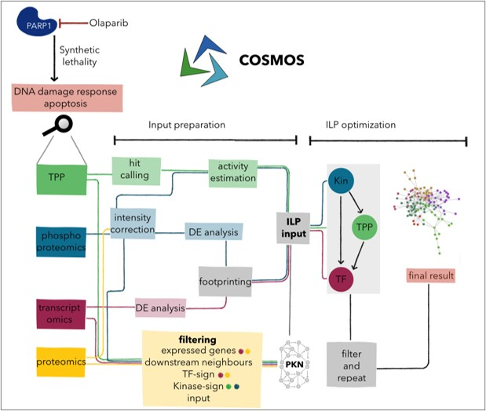

# COSMOS-TPP_paper

## Repository to summarise Master Thesis for paper

All analyses in this repository start from differential expression results of (phospho)proteomics and transcriptomics experiments, as well as TPP intensities for the generated 2D-TPP data. **Detailed information for all datasets and scripts is provided here: [*doc/Notes.md*](doc/Notes.md).**

## Quick summary

The deregulation of complex diseases often spans multiple cellular processes. A multimodal functional characterization of the underlying molecular processes can shed light on the diseases and the effect of drugs. Thermal Proteome Profiling (TPP) is a mass-spectrometry based technique assessing changes in thermal protein stability that can serve as proxies of  functional changes of the proteome. These unique insights of TPP can complement those obtained by other omics technologies. Here, we show how TPP can be integrated  with phosphoproteomics and transcriptomics in a network-based approach using COSMOS, a framework for causal integration of multi-omics, to provide an integrated view of  transcription factors, kinases and other proteins. This allowed us to recover known consequences of PARP inhibition in ovarian cancer cells on cell cycle and DNA damage response in detail and to shed new insights into reported additional drug response mechanisms related to interferon and hippo signaling. We found that TPP complements the other omics data and allowed us to obtain a network model with higher coverage of the main underlying mechanisms. These results illustrate the added value of TPP, and how this data can be combined with others in network models. We anticipate that this strategy can be used and adapted to generally integrate functional proteomics data with other data to study complex molecular processes.

