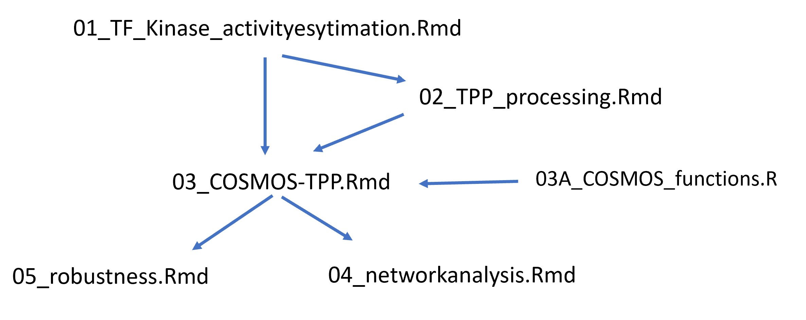

# Notes 

### Manuscript

- manuscript and related things collected here: https://docs.google.com/document/d/1WOR2ZgmqIc6V33ewTY4fMv6B9oPlku0soLehotvx2nM/edit#heading=h.eu7un576ybac

### Datasets (*data/ folder*)

-   **TPP**: 2DTPP_UWB_Ola_2021-03-24.txt

-   **Prior knowledge resources**: dorothea, KSN, COSMOS PKN

### Data objects (*data/ and results/ folder*)

-   **Viper results**: 220510_viper_footprints.RData

-   **Multi-omics dataset**: 220531_limma_multiomics_forpaper.RData (temp), 210802_limma_UWB1.289_initialdataset_correctedphospho.RData

-   **TPP**: 220530_TPPallscores.RData (processed hits), 211007_TPPfstathits_UWB24h.RData (intermediate results)

-   **COSMOS input**: 220512_cosmosinput_merged.RData (with F-statistic data)

-   **Networks**: 220531_mergednetworkresults.RData

-   **Robustness networks**: 220531_mergednetworkresults_robustness.RData

### Scripts

---

- in [*src/01_TF_Kinase_activityestimation.Rmd*](https://github.com/miralea/COSMOS-TPP_paper/tree/master/src/01_TF_Kinase_activityestimation.Rmd) we estimate the activity of kinases, phosphatases and transcription factors based on transcriptomics and phosphoproteomics data

- in [*src/02_TPP_processing.Rmd*](https://github.com/miralea/COSMOS-TPP_paper/tree/master/src/02_TPP_processing.Rmd) we perform TPP hit calling and investigate the retrieved hits

- in [*src/03_COSMOS-TPP.Rmd*](https://github.com/miralea/COSMOS-TPP_paper/tree/master/src/03_COSMOS-TPP.Rmd) we model networks using the results of the first two analyses

- in [*src/03A_COSMOS_functions.R*](https://github.com/miralea/COSMOS-TPP_paper/tree/master/src/03A_COSMOS_functions.R) we collected funstions necessary to run COSMOS (based on the original publication)

- in [*src/04_networkanalysis.Rmd*](https://github.com/miralea/COSMOS-TPP_paper/tree/master/src/04_networkanalysis.Rmd) we analyse the resulting multi-omic networks

- in [*src/05_robustness.Rmd*](https://github.com/miralea/COSMOS-TPP_paper/tree/master/src/05_robustness.Rmd) we perform an small robustness analysis of the network modeling
