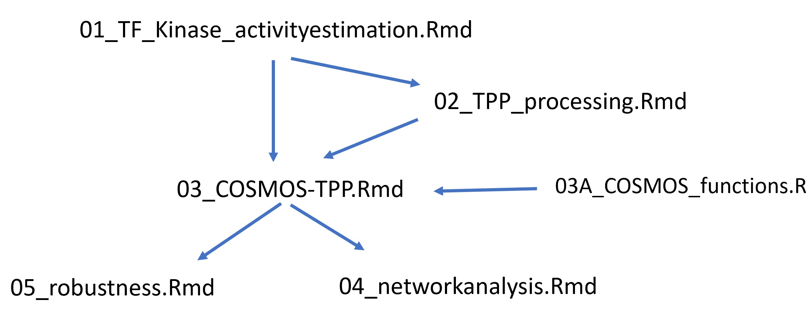

# Notes 

## Manuscript

- manuscript and related things collected here: https://docs.google.com/document/d/1WOR2ZgmqIc6V33ewTY4fMv6B9oPlku0soLehotvx2nM/edit#heading=h.eu7un576ybac

## Datasets (data folder)

-   TPP: 2DTPP_UWB_Ola_2021-03-24.txt

-   dorothea, KSN, COSMOS PKN

## Data objects (data and results folder)

-   viper results: 220510_viper_footprints.RData

-   Multi-omics dataset: 220531_limma_multiomics_forpaper.RData (temp), 210802_limma_UWB1.289_initialdataset_correctedphospho.RData

-   TPP: 220530_TPPallscores.RData (processed hits), 211007_TPPfstathits_UWB24h.RData (intermediate results)

-   COSMOS input: 220512_cosmosinput_merged.RData (with F-statistic data)

-   Networks: 220531_mergednetworkresults.RData

-   Robustness networks: 220531_mergednetworkresults_robustness.RData

## Scripts

