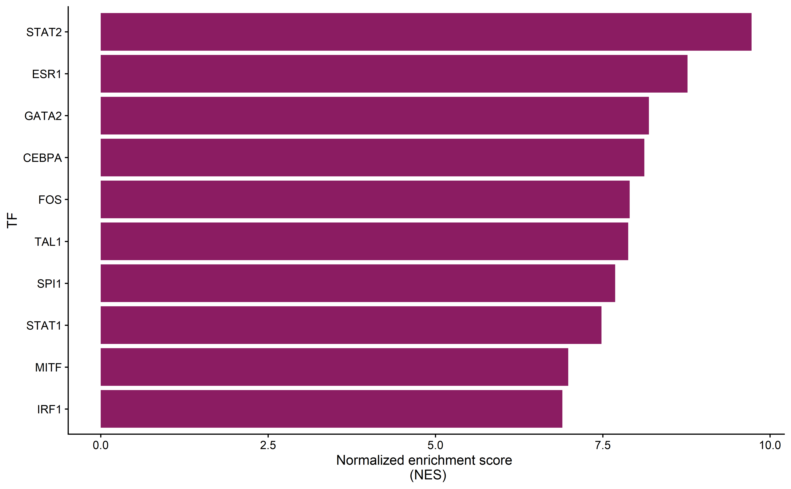
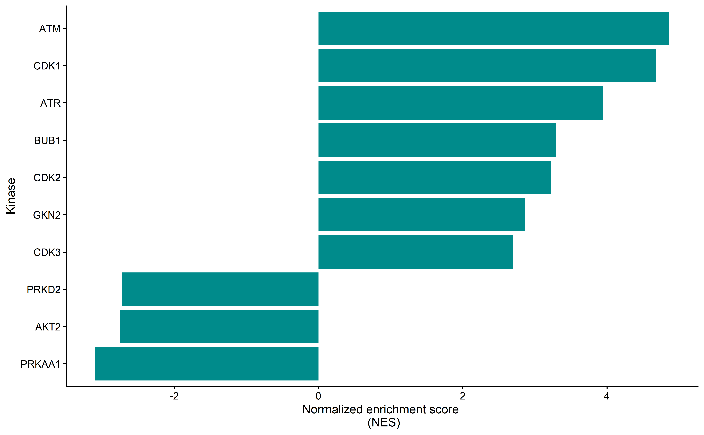

# General settings


```r
knitr::opts_chunk$set(
  echo = TRUE,
  warning = FALSE,
  message = FALSE,
  include = TRUE,
  cache = TRUE,
  cache.lazy = FALSE,
  eval = TRUE,
  dpi = 500,
  fig.width = 6 * (1 + sqrt(5)) / 2, fig.height = 6 # golden ratio
)

knitr::opts_knit$set(root.dir = "C:/Users/burtsche/Documents/COSMOS-TPP_paper")
```

## Load packages


```r
library(tidyverse)
library("reshape2")
library(OmnipathR)
library(viridis)
library(ggrepel)
options(connectionObserver = NULL)
library(org.Hs.eg.db)
library(visNetwork)
library(knitr)
library(viper)
library(ggpubr)
library(tidytext)
library(pheatmap)
library(kableExtra)
library(ReactomePA)
library(cowplot)

mutate <- dplyr::mutate
select <- dplyr::select
group_by <- dplyr::group_by
```

## Enrichment function


```r
GSE_RPA <- function(geneList, universe) {
  geneList <- mapIds(org.Hs.eg.db, geneList, "ENTREZID", "SYMBOL")
  universe <- mapIds(org.Hs.eg.db, universe,'ENTREZID','SYMBOL')
  pathway_enrichment <- enrichPathway(
    gene = geneList,
    organism = "human",
    pvalueCutoff = 1,
    pAdjustMethod = "BH",
    qvalueCutoff = 1,
    universe = universe,
    minGSSize = 5,
    maxGSSize = 500,
    readable = TRUE
  )
}
```


## Footprinting Functions


```r
df_to_viper_regulon <- function(df) {
  names(df) <- c("feature", "pathway", "sign")
  df <- df[complete.cases(df), ]

  pathway_regulon <- list(0)
  i <- 1
  for (pathway in unique(df$pathway))
  {
    pathway_feature_list <- list(0)
    features <- df[df$pathway == pathway, 3]
    names(features) <- df[df$pathway == pathway, 1]
    pathway_feature_list[[1]] <- features
    pathway_feature_list[[2]] <- rep(1, length(features))
    names(pathway_feature_list) <- c("tfmode", "likelihood")

    pathway_regulon[[i]] <- pathway_feature_list
    i <- i + 1
  }
  names(pathway_regulon) <- unique(df$pathway)
  return(pathway_regulon)
}
```

# Input

## Prior knowledge reosurces


```r
# dorothea = OmnipathR::import_dorothea_interactions(dorothea_levels = c("A", "B", "C"))
# dorothea <- as.data.frame(dorothea) %>%
#   dplyr::mutate(sign = ifelse(is_inhibition ==1, -1, 1)) %>% 
#   dplyr::select(target_genesymbol, source_genesymbol, sign) %>% 
#   setNames(c("target", "tf", "mor")) %>%
#   distinct(target, tf, mor)

dorothea <- as.data.frame(read_csv("data/DOROTHEA_20200205.csv")) %>%
  dplyr::mutate(sign = ifelse(is_inhibition ==1, -1, 1)) %>% 
  dplyr::select(target_genesymbol, source_genesymbol, sign)%>% 
  setNames(c("target", "tf", "mor")) %>%
  distinct(target, tf, mor)

dorothea_viper <- df_to_viper_regulon(dorothea)

# omnipath_ptm <- OmnipathR::get_signed_ptms() %>%
#   dplyr::filter(modification %in% c("dephosphorylation","phosphorylation")) %>%
#   dplyr::mutate(p_site = paste0(substrate_genesymbol, "_", residue_type, residue_offset),
#                 mor = ifelse(modification == "phosphorylation", 1, -1)) %>%
#   dplyr::transmute(p_site, enzyme_genesymbol, mor) %>%
#   as.data.frame() %>% 
#   distinct(p_site, enzyme_genesymbol, mor) %>% 
#   setNames(c("target_genesymbol", "source_genesymbol", "sign"))

KSN <- as.data.frame(read_csv("data/omnipath_ptm_20200205.csv"))%>%
  dplyr::filter(modification %in% c("dephosphorylation","phosphorylation")) %>%
  dplyr::mutate(p_site = paste0(substrate_genesymbol, "_", residue_type, residue_offset),
                mor = ifelse(modification == "phosphorylation", 1, -1)) %>%
  dplyr::transmute(p_site, enzyme_genesymbol, mor) %>%
  as.data.frame() %>%
  distinct(p_site, enzyme_genesymbol, mor) %>%
  setNames(c("target_genesymbol", "source_genesymbol", "sign"))

KSN_viper <- df_to_viper_regulon(KSN)
```


## Load gathered datasets.


```r
load("data/210626_DEmultiomics_Olaparib_gathered_updated")
### Corrected phosphodata
load("data/210802_limma_UWB1.289_initialdataset_correctedphospho.RData")
```

# Perform footprinting

## Transcriptomics


```r
expression_data_trans <- transcriptomics_ola %>%
  filter(!is.na(GeneSymbol) & !is.na(logFC) & condition_long == "UWB1.289_24h_4uM") %>%
  distinct(EntrezID, condition_long, .keep_all = T) %>%
  as.data.frame() %>%
  dplyr::select(GeneSymbol, condition_long, logFC) %>%
  setNames(c("ID_cosmos", "condition_long", "logFC")) 
```


```r
p_TFregulators <- viperRes_trans %>%
  group_by(condition_long) %>%
  top_n(n = 10, wt = absNES) %>%
  ungroup() %>%
  mutate(
    condtion_long = as.factor(condition_long),
    regulator = reorder_within(regulator, NES, condition_long)
  ) %>%
  ggplot(aes(y = NES, x = regulator)) +
  geom_bar(stat = "identity", fill = "maroon4") +
  scale_x_reordered() +
  coord_flip() +
  theme_bw(12) +
  cowplot::theme_cowplot(font_size = 12) +
  theme(legend.position = "none", panel.grid = element_blank()) +
  labs(y = "Normalized enrichment score \n (NES)", x = "TF")
p_TFregulators
```

<!-- -->


## Phosphoproteomics after correction


```r
psites <- limma_UWB1.289_initialdataset_correctedphospho %>%
  mutate(
    gene_name = mapIds(org.Hs.eg.db, representative, "SYMBOL", "UNIPROT"),
    condition_long = paste(condition, comparison, sep = "_"),
    UP = representative,
    GeneSymbol = gene_name,
    aa = str_extract(psite, "[[:upper:]]"),
    pos = as.numeric(str_extract(psite, "\\d{1,4}")),
    ID_cosmos = paste(GeneSymbol, "_", aa, pos, sep = ""),
    ID_cosmos = gsub(",.+$", "", ID_cosmos))%>%
  filter(!is.na(logFC) & !is.na(ID_cosmos)&comparison == "Ola") %>%
  dplyr::select(ID_cosmos, logFC, t, condition_long)%>% 
  dplyr::mutate(
    condition_long = stringr::str_replace(condition_long, "_Ola", "uM"),
    condition_long = stringr::str_replace(condition_long, "BRCA_hom", "UWB1.289_BRCA1"),
    condition_long = stringr::str_replace(condition_long, "BRCA_nul", "UWB1.289"),
    condition_long = stringr::str_replace(condition_long, "04", "0.4")
  ) %>% 
  filter(condition_long == "UWB1.289_24h_4uM") %>% 
  distinct(ID_cosmos, condition_long, .keep_all = T) 
```


```r
p_kinaseregulators <- viperRes_phospho_corrected %>%
  group_by(condition_long) %>%
  top_n(n = 10, wt = absNES) %>%
  ungroup() %>%
  mutate(
    condtion_long = as.factor(condition_long),
    regulator = reorder_within(regulator, NES, condition_long)
  ) %>%
  ggplot(aes(y = NES, x = regulator)) +
  geom_bar(stat = "identity", fill = "darkcyan") +
  scale_x_reordered() +
  coord_flip() +
  theme_bw(12) +
  cowplot::theme_cowplot(font_size = 12) +
  theme(legend.position = "none", panel.grid = element_blank()) +
  labs(y = "Normalized enrichment score \n (NES)", x = "Kinase")
p_kinaseregulators
```

<!-- -->


# Evaluation in biological context

## Reactome


```r
pathway_check_input <- bind_rows("phospho" = viperRes_phospho_corrected, "trans" = viperRes_trans, .id = "type") %>%
  group_by(type) %>%
  top_n(n = 20, wt = absNES)


pathways_universe <- transcriptomics_ola %>%
  dplyr::select(GeneSymbol, logFC) %>%
  setNames(c("protein", "NES"))

pathway_enrichment <- pathway_check_input %>%
  group_by(type) %>%
  mutate(enrichment = list(as.data.frame(GSE_RPA(
    geneList = regulator,
    universe = pathways_universe$protein
  ))))

pathway_enrichment_unnest <- pathway_enrichment %>%
  distinct(type, enrichment) %>%
  distinct(enrichment) %>% 
  unnest()

pathway_enrichment_significant <- pathway_enrichment_unnest %>%
  filter(qvalue < 0.05)

pathway_enrichment_significant %>% filter(type == "trans") %>% select(Description, qvalue, geneID)
```

```
## # A tibble: 155 × 4
## # Groups:   type [1]
##    type  Description                                               qvalue geneID
##    <chr> <chr>                                                      <dbl> <chr> 
##  1 trans "Homo sapiens\r: Transcriptional regulation of granulop… 3.29e-5 CEBPA…
##  2 trans "Homo sapiens\r: RUNX1 regulates transcription of genes… 7.13e-5 GATA3…
##  3 trans "Homo sapiens\r: Transcriptional regulation by RUNX1"    7.13e-5 GATA3…
##  4 trans "Homo sapiens\r: Estrogen-dependent gene expression"     1.03e-4 FOS/F…
##  5 trans "Homo sapiens\r: Signaling by Interleukins"              1.54e-4 FOS/G…
##  6 trans "Homo sapiens\r: SUMO E3 ligases SUMOylate target prote… 1.77e-4 TFAP2…
##  7 trans "Homo sapiens\r: SUMOylation"                            1.77e-4 TFAP2…
##  8 trans "Homo sapiens\r: Interleukin-4 and Interleukin-13 signa… 2.70e-4 FOS/G…
##  9 trans "Homo sapiens\r: ESR-mediated signaling"                 2.70e-4 FOS/F…
## 10 trans "Homo sapiens\r: CLEC7A/inflammasome pathway"            2.70e-4 NFKB1…
## # … with 145 more rows
```

```r
pathway_enrichment_significant %>% filter(type == "phospho") %>% select(Description, qvalue, geneID)
```

```
## # A tibble: 165 × 4
## # Groups:   type [1]
##    type    Description                                             qvalue geneID
##    <chr>   <chr>                                                    <dbl> <chr> 
##  1 phospho "Homo sapiens\r: Regulation of TP53 Activity"          9.99e-8 PRKAA…
##  2 phospho "Homo sapiens\r: Transcriptional Regulation by TP53"   5.12e-7 PRKAA…
##  3 phospho "Homo sapiens\r: Regulation of TP53 Activity through … 3.94e-6 PRKAA…
##  4 phospho "Homo sapiens\r: Regulation of TP53 Degradation"       3.94e-6 AKT2/…
##  5 phospho "Homo sapiens\r: Regulation of TP53 Expression and De… 3.94e-6 AKT2/…
##  6 phospho "Homo sapiens\r: Cell Cycle Checkpoints"               6.61e-4 CDK1/…
##  7 phospho "Homo sapiens\r: TP53 Regulates Transcription of Cell… 6.61e-4 CDK1/…
##  8 phospho "Homo sapiens\r: G2/M Checkpoints"                     1.07e-3 CDK1/…
##  9 phospho "Homo sapiens\r: TP53 Regulates Transcription of DNA … 1.28e-3 ATR/A…
## 10 phospho "Homo sapiens\r: Cellular response to heat stress"     2.93e-3 ATR/A…
## # … with 155 more rows
```


# Save results


```r
save(viperRes_trans, viperRes_phospho_corrected,
  file = "data/220510_viper_footprints.RData")

save(dorothea,
     file = "data/dorothea.RData")

save(KSN,
     file = "data/KSN.RData")
```
