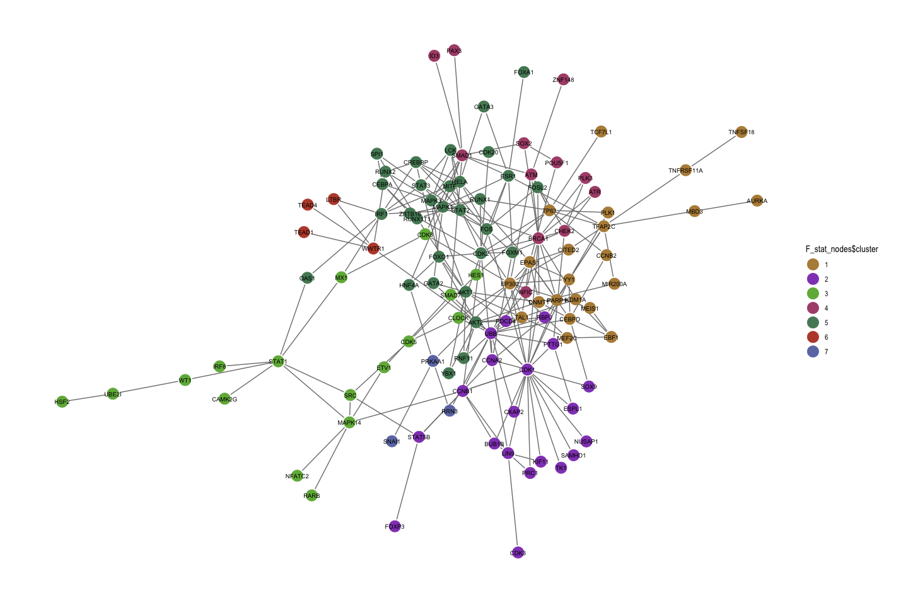
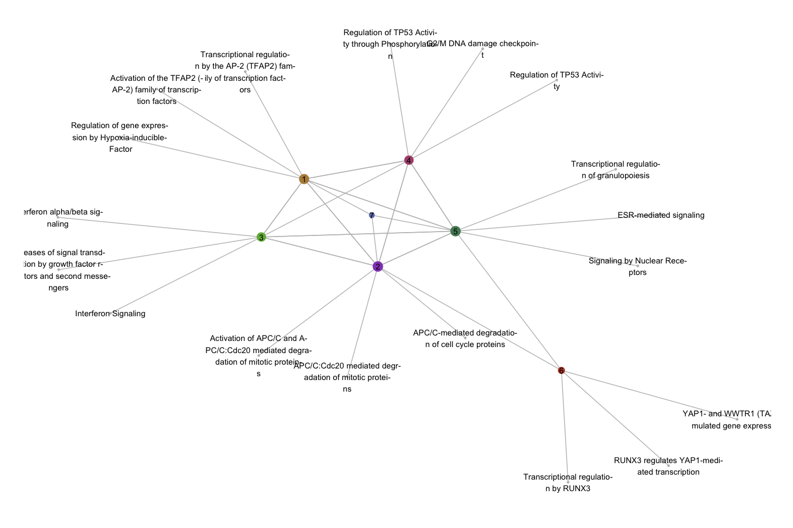
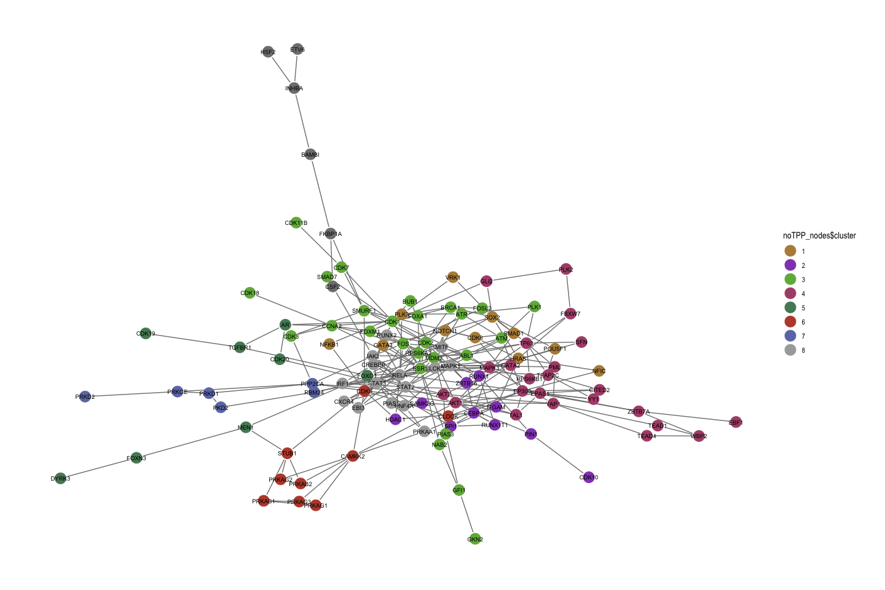
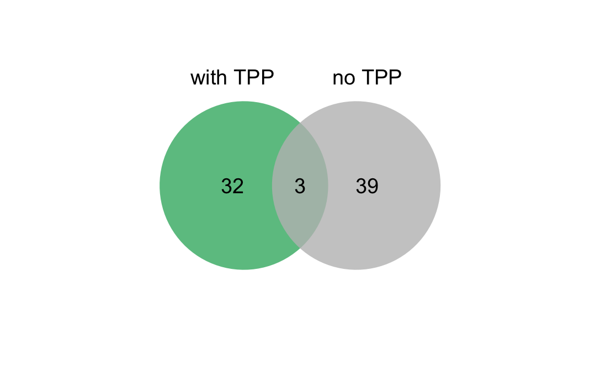
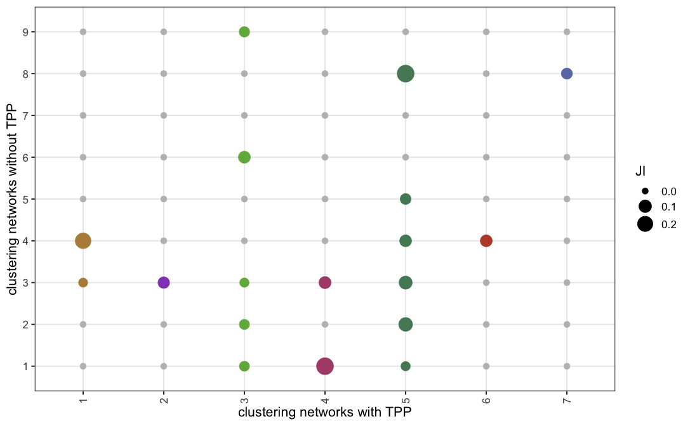

This script summariyes efforts performed to analzye the role of TPP proteins in COSMOS networks. We saw that the processes in the overall network reflect our expectations (DDR). Here, we move on to a more granular view, by analyzing processes on cluster level.

# General settings


```r
knitr::opts_chunk$set(
  echo = TRUE,
  warning = FALSE,
  message = FALSE,
  include = TRUE,
  cache = TRUE,
  cache.lazy = FALSE,
  eval = TRUE,
  fig.width = 7 * (1 + sqrt(5)) / 2, fig.height = 7
)
knitr::opts_knit$set(root.dir = "/Users/miraburtscher/Documents/Bioquant/COSMOS-TPP_paper/")
```

## Packages


```r
library(tidyverse)
library(igraph)
library("reshape2")
library(OmnipathR)
library(xlsx)
library(viridis)
library(ggrepel)
options(connectionObserver = NULL)
library(org.Hs.eg.db)
library(visNetwork)
library(knitr)
library(ggpubr)
library(NetworkDistance)
library(Rcpp)
library(RColorBrewer)
library(networkD3)
library(kableExtra)
library(ReactomePA)
library(clusterProfiler)
library(ggraph)
library(reactome.db)

mutate <- dplyr::mutate
select <- dplyr::select
group_by <- dplyr::group_by
```

## Functions

Enrichment functions for GO and RPA enrichments


```r
GSE_RPA <- function(geneList, universe) {
  geneList <- mapIds(org.Hs.eg.db, geneList, "ENTREZID", "SYMBOL")
  universe <- mapIds(org.Hs.eg.db, universe, "ENTREZID", "SYMBOL")
  pathway_enrichment <- enrichPathway(
    gene = geneList,
    organism = "human",
    pvalueCutoff = 1,
    pAdjustMethod = "BH",
    qvalueCutoff = 1,
    universe = universe,
    minGSSize = 5,
    maxGSSize = 500,
    readable = TRUE
  )
}

GSE_MF <- function(geneList, universe, ont) {
  geneList <- mapIds(org.Hs.eg.db, geneList, "ENTREZID", "SYMBOL")
  universe <- mapIds(org.Hs.eg.db, universe, "ENTREZID", "SYMBOL")
  pathway_enrichment <- clusterProfiler::enrichGO(
    gene = geneList,
    ont = ont,
    OrgDb = "org.Hs.eg.db",
    pvalueCutoff = 1,
    pAdjustMethod = "BH",
    qvalueCutoff = 1,
    universe = universe,
    minGSSize = 5,
    maxGSSize = 500,
    readable = TRUE
  )
}
```

## PKN data


```r
load("data/KSN.RData")
load("data/dorothea.RData")

PKN_annotated <- read_tsv("data/GSK_Causal_Network_032021_Annotation.txt", show_col_types = FALSE)
```

## Viper results


```r
load("data/210802_viper_footprints.RData")
viper_kinases <- viperRes_phospho_corrected %>%
  filter(condition_long == "BRCA_nul_24h_4_Ola") %>%
  arrange(desc(absNES)) %>%
  slice_head(n = 30) %>%
  mutate(measured = ifelse(NES < 0, "inactive", "active"), type = "Kinase", node = regulator) %>%
  select(id = regulator, node, measured, type)
```

# Load and process networks 


```r
load("data/2022_02_17_MasterThesis_networks.RData")
```


```r
nodes <- map_dfr(result_list, "nodes", .id = "networkID") %>%
  dplyr::select(networkID, label, measured)

nodes <- map_dfr(network_list, "overall_node_summary", .id = "networkID") %>%
  separate(networkID, into = c("TPP_set", "replicate", "PKN"), sep = "_", remove = F) %>%
  left_join(nodes, by = c("networkID", "node" = "label")) %>%
  mutate(
    model = gsub("input", "input node modelled", model),
    model = gsub("missed", "input node not modelled", model),
    model = gsub("additional", "PKN node", model),
    id = node
  )

edges <- map_dfr(result_list, "combined_network", .id = "networkID") %>%
  mutate(edge_combined = paste(from, sign, to, sep = "_")) %>%
  distinct(networkID, edge_combined, .keep_all = T) %>%
  separate(networkID, into = c("TPP_set", "replicate", "PKN"), sep = "_", remove = F)
```

Extract F-statistic results and results without TPP


```r
F_stat_edges <- filter(edges, TPP_set == "Fstatistic") %>%
  distinct(edge_combined, .keep_all = T)

F_stat_nodes <- data.frame(id = unique(c(F_stat_edges$from, F_stat_edges$to))) %>%
  left_join(distinct(nodes, id, .keep_all = T)) %>%
  mutate(group = paste(type, measured, sep = "_"))

F_stat_nodes <- nodes %>%
  filter(TPP_set == "Fstatistic" & model != "input node not modelled" & measured != "not available") %>%
  distinct(id, .keep_all = T) %>%
  mutate(group = paste(type, measured, sep = "_"))

F_stat_nodes <- bind_rows(
  filter(viper_kinases, id %in% F_stat_nodes$id),
  F_stat_nodes
) %>%
  distinct(id, .keep_all = T) %>%
  mutate(group = paste(type, measured, sep = "_"))


noTPP_edges <- filter(edges, TPP_set == "noTPP") %>%
  distinct(edge_combined, .keep_all = T)


noTPP_nodes <- data.frame(id = unique(c(noTPP_edges$from, noTPP_edges$to))) %>%
  left_join(distinct(nodes, id, .keep_all = T)) %>%
  mutate(group = paste(type, measured, sep = "_"))
```

## Plots


```r
set.seed(1)
p <- visNetwork(F_stat_nodes, F_stat_edges) %>%
  visGroups(groupname = "TPP_active", color = "mediumseagreen") %>%
  visGroups(groupname = "TPP_inactive", color = "palegreen") %>%
  visGroups(groupname = "TF_active", color = "#8b0a50") %>%
  visGroups(groupname = "TF_inactive", color = "palevioletred") %>%
  visGroups(groupname = "Kinase_active", color = "darkcyan") %>%
  visGroups(groupname = "Kinase_inactive", color = "mediumturquoise") %>%
  visGroups(groupname = "other_active", color = "burlywood") %>%
  visGroups(groupname = "other_inactive", color = "wheat") %>%
  # standard options
  visEdges(arrows = "to", color = "dimgrey", width = 2) %>%
  visNodes(font = "30px arial black bold") %>%
  visLegend() %>%
  visOptions(highlightNearest = TRUE, nodesIdSelection = TRUE) %>%
  visNetwork::visIgraphLayout(layout = "layout_with_kk")
p
```

```{=html}
<div id="htmlwidget-f843a680a1fcd62a0dd1" style="width:1087.31884043993px;height:672px;" class="visNetwork html-widget"></div>
<script type="application/json" data-for="htmlwidget-f843a680a1fcd62a0dd1">{"x":{"nodes":{"id":["ATM","CDK1","ATR","CDK2","PRKAA1","AKT2","CDK3","CDK8","CDK20","CAMK2G","PLK3","AKT1","CDK5","ESR1","STAT3","CEBPA","RUNX2","WWTR1","CHEK2","HNF4A","RELA","FOS","CCNA2","FOXM1","TFAP2C","MITF","STAT2","PLK1","FOSL2","STAT1","CCNB1","PTTG1","GATA3","SPI1","FOXO1","TEAD4","TEAD1","GATA2","TAL1","CLOCK","IRF1","SOX2","RUNX1","FOXA1","EPAS1","RRN3","BUB1B","PDCD4","KIF11","CKAP2","PRC1","MX1","OAS1","ESPL1","DNMT1","NUSAP1","SAMHD1","TK1","CCNB2","CREBBP","SMAD1","RUNX1T1","TP63","ZBTB16","BRCA1","MAPK1","MAPK14","SRC","UBE2I","SMAD7","STAT5B","ETV1","WT1","IRF8","ZNF148","HSF2","HES1","ID3","RARB","FOXP3","YBX1","SNAI1","NFATC2","PAX3","TCF7L1","LCK","MAPK3","POU5F1","AURKA","SOX9","TNFSF18","PARP1","NFIC","EBF1","EP300","MBD3","MEIS1","CEBPD","CITED2","YY1","MEF2C","TNFRSF11A","MIR200A","KDM1A","LIN9","LTBR","RBPJ","UBB","RNF11"],"node":["ATM","CDK1","ATR","CDK2","PRKAA1","AKT2","CDK3","CDK8","CDK20","CAMK2G","PLK3","AKT1","CDK5","ESR1","STAT3","CEBPA","RUNX2","WWTR1","CHEK2","HNF4A","RELA","FOS","CCNA2","FOXM1","TFAP2C","MITF","STAT2","PLK1","FOSL2","STAT1","CCNB1","PTTG1","GATA3","SPI1","FOXO1","TEAD4","TEAD1","GATA2","TAL1","CLOCK","IRF1","SOX2","RUNX1","FOXA1","EPAS1","RRN3","BUB1B","PDCD4","KIF11","CKAP2","PRC1","MX1","OAS1","ESPL1","DNMT1","NUSAP1","SAMHD1","TK1","CCNB2","CREBBP","SMAD1","RUNX1T1","TP63","ZBTB16","BRCA1","MAPK1","MAPK14","SRC","UBE2I","SMAD7","STAT5B","ETV1","WT1","IRF8","ZNF148","HSF2","HES1","ID3","RARB","FOXP3","YBX1","SNAI1","NFATC2","PAX3","TCF7L1","LCK","MAPK3","POU5F1","AURKA","SOX9","TNFSF18","PARP1","NFIC","EBF1","EP300","MBD3","MEIS1","CEBPD","CITED2","YY1","MEF2C","TNFRSF11A","MIR200A","KDM1A","LIN9","LTBR","RBPJ","UBB","RNF11"],"measured":["active","active","active","active","inactive","inactive","active","active","active","active","active","inactive","active","active","active","active","active","active","active","active","active","active","active","active","active","active","active","inactive","active","active","active","active","active","active","active","active","active","active","active","active","active","active","active","active","active","active","active","active","active","active","active","active","active","inactive","inactive","inactive","inactive","inactive","inactive","active","inactive","inactive","active","inactive","active","active","active","active","inactive","inactive","active","inactive","active","active","active","active","active","active","active","active","inactive","inactive","inactive","inactive","inactive","active","inactive","active","inactive","inactive","active","active","active","active","active","inactive","active","active","active","inactive","active","inactive","inactive","inactive","active","active","active","inactive","inactive"],"type":["Kinase","Kinase","Kinase","Kinase","Kinase","Kinase","Kinase","Kinase","Kinase","Kinase","Kinase","Kinase","Kinase","TF","TF","TF","TF","TPP","TPP","TF","TF","TF","TPP","TF","TF","TF","TF","TPP","TF","TF","TPP","TPP","TF","TF","TF","TF","TF","TF","TF","TF","TF","TF","TF","TF","TF","TPP","TPP","TPP","TPP","TPP","TPP","TPP","TPP","TPP","TPP","TPP","TPP","TPP","TPP","other","TF","Kinase","TF","TF","Kinase","Kinase","Kinase","Kinase","other","TF","TF","TF","TF","TF","TF","TF","TF","TF","TF","TF","TF","TF","TF","TF","TF","Kinase","Kinase","TF","TPP","TPP","TPP","TPP","TF","TF","Kinase","other","TF","TF","other","TF","TF","other","other","Kinase","other","other","TF","other","other"],"networkID":[null,null,null,null,null,null,null,null,null,null,null,null,null,"Fstatistic_rep1_COSMOSnew","Fstatistic_rep1_COSMOSnew","Fstatistic_rep1_COSMOSnew","Fstatistic_rep1_COSMOSnew","Fstatistic_rep1_COSMOSnew","Fstatistic_rep1_COSMOSnew","Fstatistic_rep1_COSMOSnew","Fstatistic_rep1_COSMOSnew","Fstatistic_rep1_COSMOSnew","Fstatistic_rep1_COSMOSnew","Fstatistic_rep1_COSMOSnew","Fstatistic_rep1_COSMOSnew","Fstatistic_rep1_COSMOSnew","Fstatistic_rep1_COSMOSnew","Fstatistic_rep1_COSMOSnew","Fstatistic_rep1_COSMOSnew","Fstatistic_rep1_COSMOSnew","Fstatistic_rep1_COSMOSnew","Fstatistic_rep1_COSMOSnew","Fstatistic_rep1_COSMOSnew","Fstatistic_rep1_COSMOSnew","Fstatistic_rep1_COSMOSnew","Fstatistic_rep1_COSMOSnew","Fstatistic_rep1_COSMOSnew","Fstatistic_rep1_COSMOSnew","Fstatistic_rep1_COSMOSnew","Fstatistic_rep1_COSMOSnew","Fstatistic_rep1_COSMOSnew","Fstatistic_rep1_COSMOSnew","Fstatistic_rep1_COSMOSnew","Fstatistic_rep1_COSMOSnew","Fstatistic_rep1_COSMOSnew","Fstatistic_rep1_COSMOSnew","Fstatistic_rep1_COSMOSnew","Fstatistic_rep1_COSMOSnew","Fstatistic_rep1_COSMOSnew","Fstatistic_rep1_COSMOSnew","Fstatistic_rep1_COSMOSnew","Fstatistic_rep1_COSMOSnew","Fstatistic_rep1_COSMOSnew","Fstatistic_rep1_COSMOSnew","Fstatistic_rep1_COSMOSnew","Fstatistic_rep1_COSMOSnew","Fstatistic_rep1_COSMOSnew","Fstatistic_rep1_COSMOSnew","Fstatistic_rep1_COSMOSnew","Fstatistic_rep1_COSMOSnew","Fstatistic_rep1_COSMOSnew","Fstatistic_rep1_COSMOSnew","Fstatistic_rep1_COSMOSnew","Fstatistic_rep1_COSMOSnew","Fstatistic_rep1_COSMOSnew","Fstatistic_rep1_COSMOSnew","Fstatistic_rep1_COSMOSnew","Fstatistic_rep1_COSMOSnew","Fstatistic_rep1_COSMOSnew","Fstatistic_rep1_COSMOSnew","Fstatistic_rep1_COSMOSnew","Fstatistic_rep1_COSMOSnew","Fstatistic_rep1_COSMOSnew","Fstatistic_rep1_COSMOSnew","Fstatistic_rep1_COSMOSnew","Fstatistic_rep1_COSMOSnew","Fstatistic_rep1_COSMOSnew","Fstatistic_rep1_COSMOSnew","Fstatistic_rep1_COSMOSnew","Fstatistic_rep1_COSMOSnew","Fstatistic_rep1_COSMOSnew","Fstatistic_rep1_COSMOSnew","Fstatistic_rep1_COSMOSnew","Fstatistic_rep1_COSMOSnew","Fstatistic_rep1_COSMOSnew","Fstatistic_rep2_COSMOSnew","Fstatistic_rep2_COSMOSnew","Fstatistic_rep2_COSMOSnew","Fstatistic_rep1_GSK","Fstatistic_rep1_GSK","Fstatistic_rep1_GSK","Fstatistic_rep1_GSK","Fstatistic_rep1_GSK","Fstatistic_rep1_GSK","Fstatistic_rep1_GSK","Fstatistic_rep1_GSK","Fstatistic_rep1_GSK","Fstatistic_rep1_GSK","Fstatistic_rep1_GSK","Fstatistic_rep1_GSK","Fstatistic_rep1_GSK","Fstatistic_rep1_GSK","Fstatistic_rep1_GSK","Fstatistic_rep1_GSK","Fstatistic_rep1_GSK","Fstatistic_rep1_GSK","Fstatistic_rep1_GSK","Fstatistic_rep1_GSK","Fstatistic_rep1_GSK"],"TPP_set":[null,null,null,null,null,null,null,null,null,null,null,null,null,"Fstatistic","Fstatistic","Fstatistic","Fstatistic","Fstatistic","Fstatistic","Fstatistic","Fstatistic","Fstatistic","Fstatistic","Fstatistic","Fstatistic","Fstatistic","Fstatistic","Fstatistic","Fstatistic","Fstatistic","Fstatistic","Fstatistic","Fstatistic","Fstatistic","Fstatistic","Fstatistic","Fstatistic","Fstatistic","Fstatistic","Fstatistic","Fstatistic","Fstatistic","Fstatistic","Fstatistic","Fstatistic","Fstatistic","Fstatistic","Fstatistic","Fstatistic","Fstatistic","Fstatistic","Fstatistic","Fstatistic","Fstatistic","Fstatistic","Fstatistic","Fstatistic","Fstatistic","Fstatistic","Fstatistic","Fstatistic","Fstatistic","Fstatistic","Fstatistic","Fstatistic","Fstatistic","Fstatistic","Fstatistic","Fstatistic","Fstatistic","Fstatistic","Fstatistic","Fstatistic","Fstatistic","Fstatistic","Fstatistic","Fstatistic","Fstatistic","Fstatistic","Fstatistic","Fstatistic","Fstatistic","Fstatistic","Fstatistic","Fstatistic","Fstatistic","Fstatistic","Fstatistic","Fstatistic","Fstatistic","Fstatistic","Fstatistic","Fstatistic","Fstatistic","Fstatistic","Fstatistic","Fstatistic","Fstatistic","Fstatistic","Fstatistic","Fstatistic","Fstatistic","Fstatistic","Fstatistic","Fstatistic","Fstatistic","Fstatistic","Fstatistic","Fstatistic"],"replicate":[null,null,null,null,null,null,null,null,null,null,null,null,null,"rep1","rep1","rep1","rep1","rep1","rep1","rep1","rep1","rep1","rep1","rep1","rep1","rep1","rep1","rep1","rep1","rep1","rep1","rep1","rep1","rep1","rep1","rep1","rep1","rep1","rep1","rep1","rep1","rep1","rep1","rep1","rep1","rep1","rep1","rep1","rep1","rep1","rep1","rep1","rep1","rep1","rep1","rep1","rep1","rep1","rep1","rep1","rep1","rep1","rep1","rep1","rep1","rep1","rep1","rep1","rep1","rep1","rep1","rep1","rep1","rep1","rep1","rep1","rep1","rep1","rep1","rep1","rep1","rep1","rep1","rep1","rep1","rep2","rep2","rep2","rep1","rep1","rep1","rep1","rep1","rep1","rep1","rep1","rep1","rep1","rep1","rep1","rep1","rep1","rep1","rep1","rep1","rep1","rep1","rep1","rep1"],"PKN":[null,null,null,null,null,null,null,null,null,null,null,null,null,"COSMOSnew","COSMOSnew","COSMOSnew","COSMOSnew","COSMOSnew","COSMOSnew","COSMOSnew","COSMOSnew","COSMOSnew","COSMOSnew","COSMOSnew","COSMOSnew","COSMOSnew","COSMOSnew","COSMOSnew","COSMOSnew","COSMOSnew","COSMOSnew","COSMOSnew","COSMOSnew","COSMOSnew","COSMOSnew","COSMOSnew","COSMOSnew","COSMOSnew","COSMOSnew","COSMOSnew","COSMOSnew","COSMOSnew","COSMOSnew","COSMOSnew","COSMOSnew","COSMOSnew","COSMOSnew","COSMOSnew","COSMOSnew","COSMOSnew","COSMOSnew","COSMOSnew","COSMOSnew","COSMOSnew","COSMOSnew","COSMOSnew","COSMOSnew","COSMOSnew","COSMOSnew","COSMOSnew","COSMOSnew","COSMOSnew","COSMOSnew","COSMOSnew","COSMOSnew","COSMOSnew","COSMOSnew","COSMOSnew","COSMOSnew","COSMOSnew","COSMOSnew","COSMOSnew","COSMOSnew","COSMOSnew","COSMOSnew","COSMOSnew","COSMOSnew","COSMOSnew","COSMOSnew","COSMOSnew","COSMOSnew","COSMOSnew","COSMOSnew","COSMOSnew","COSMOSnew","COSMOSnew","COSMOSnew","COSMOSnew","GSK","GSK","GSK","GSK","GSK","GSK","GSK","GSK","GSK","GSK","GSK","GSK","GSK","GSK","GSK","GSK","GSK","GSK","GSK","GSK","GSK"],"model":[null,null,null,null,null,null,null,null,null,null,null,null,null,"input node modelled","input node modelled","input node modelled","input node modelled","input node modelled","input node modelled","input node modelled","input node modelled","input node modelled","input node modelled","input node modelled","input node modelled","input node modelled","input node modelled","input node modelled","input node modelled","input node modelled","input node modelled","input node modelled","input node modelled","input node modelled","input node modelled","input node modelled","input node modelled","input node modelled","input node modelled","input node modelled","input node modelled","input node modelled","input node modelled","input node modelled","input node modelled","input node modelled","input node modelled","input node modelled","input node modelled","input node modelled","input node modelled","input node modelled","input node modelled","input node modelled","input node modelled","input node modelled","input node modelled","input node modelled","input node modelled","PKN node","PKN node","PKN node","PKN node","PKN node","PKN node","PKN node","PKN node","PKN node","PKN node","PKN node","PKN node","PKN node","PKN node","PKN node","PKN node","PKN node","PKN node","PKN node","PKN node","PKN node","PKN node","PKN node","PKN node","PKN node","PKN node","PKN node","PKN node","PKN node","input node modelled","input node modelled","input node modelled","input node modelled","input node modelled","input node modelled","PKN node","PKN node","PKN node","PKN node","PKN node","PKN node","PKN node","PKN node","PKN node","PKN node","PKN node","PKN node","PKN node","PKN node","PKN node"],"group":["Kinase_active","Kinase_active","Kinase_active","Kinase_active","Kinase_inactive","Kinase_inactive","Kinase_active","Kinase_active","Kinase_active","Kinase_active","Kinase_active","Kinase_inactive","Kinase_active","TF_active","TF_active","TF_active","TF_active","TPP_active","TPP_active","TF_active","TF_active","TF_active","TPP_active","TF_active","TF_active","TF_active","TF_active","TPP_inactive","TF_active","TF_active","TPP_active","TPP_active","TF_active","TF_active","TF_active","TF_active","TF_active","TF_active","TF_active","TF_active","TF_active","TF_active","TF_active","TF_active","TF_active","TPP_active","TPP_active","TPP_active","TPP_active","TPP_active","TPP_active","TPP_active","TPP_active","TPP_inactive","TPP_inactive","TPP_inactive","TPP_inactive","TPP_inactive","TPP_inactive","other_active","TF_inactive","Kinase_inactive","TF_active","TF_inactive","Kinase_active","Kinase_active","Kinase_active","Kinase_active","other_inactive","TF_inactive","TF_active","TF_inactive","TF_active","TF_active","TF_active","TF_active","TF_active","TF_active","TF_active","TF_active","TF_inactive","TF_inactive","TF_inactive","TF_inactive","TF_inactive","Kinase_active","Kinase_inactive","TF_active","TPP_inactive","TPP_inactive","TPP_active","TPP_active","TF_active","TF_active","Kinase_active","other_inactive","TF_active","TF_active","other_active","TF_inactive","TF_active","other_inactive","other_inactive","Kinase_inactive","other_active","other_active","TF_active","other_inactive","other_inactive"],"label":["ATM","CDK1","ATR","CDK2","PRKAA1","AKT2","CDK3","CDK8","CDK20","CAMK2G","PLK3","AKT1","CDK5","ESR1","STAT3","CEBPA","RUNX2","WWTR1","CHEK2","HNF4A","RELA","FOS","CCNA2","FOXM1","TFAP2C","MITF","STAT2","PLK1","FOSL2","STAT1","CCNB1","PTTG1","GATA3","SPI1","FOXO1","TEAD4","TEAD1","GATA2","TAL1","CLOCK","IRF1","SOX2","RUNX1","FOXA1","EPAS1","RRN3","BUB1B","PDCD4","KIF11","CKAP2","PRC1","MX1","OAS1","ESPL1","DNMT1","NUSAP1","SAMHD1","TK1","CCNB2","CREBBP","SMAD1","RUNX1T1","TP63","ZBTB16","BRCA1","MAPK1","MAPK14","SRC","UBE2I","SMAD7","STAT5B","ETV1","WT1","IRF8","ZNF148","HSF2","HES1","ID3","RARB","FOXP3","YBX1","SNAI1","NFATC2","PAX3","TCF7L1","LCK","MAPK3","POU5F1","AURKA","SOX9","TNFSF18","PARP1","NFIC","EBF1","EP300","MBD3","MEIS1","CEBPD","CITED2","YY1","MEF2C","TNFRSF11A","MIR200A","KDM1A","LIN9","LTBR","RBPJ","UBB","RNF11"],"x":[-0.0547994115292807,0.248329349301935,0.0573031498951253,-0.0931301122121964,-0.435351369251001,-0.154097417964307,0.825746511823791,-0.334362772747771,-0.477775738580391,-0.212547815263236,0.527058890115427,-0.259550626878764,0.332312787668956,-0.137295350981145,-0.62755990010211,-0.734803484633079,-0.806265927257353,-0.50080929076865,0.138186462661197,-0.744616953850513,-0.427789986449536,-0.153572647647605,0.144995712871406,-0.149034748476664,0.304266112163089,-0.462768596640834,-0.33785169386793,0.668778170953336,0.130785861192004,-0.331840900483657,0.0732881835459938,0.283577204804729,-0.523492170427994,-0.859017413153218,-0.43923364698934,-1,-0.931333411755113,-0.529983869962542,-0.094117601389218,-0.0331633383904326,-0.631769925027501,-0.303911824117161,-0.126070527019294,-0.121793705345155,0.0379423196383664,-0.242981959612612,0.294611427686349,-0.00999202308966973,0.534924167603486,0.38848152009057,0.656468025493787,-0.504897447794718,-0.676488481251337,0.12692787703443,0.155740200375343,0.595037251150233,0.66923902692995,0.646308002736359,0.545296302432146,-0.717992156645224,-0.461564363786741,-0.428981428520287,0.27791699720398,-0.398020460635307,0.0920823717093322,-0.422084843824332,-0.0423477941274745,0.0873226378684908,-0.710111477475436,-0.0819561134856922,0.238305367617957,0.0265519380757959,-0.566071913828551,-0.355359264289529,-0.180865366447136,-0.948629388064962,0.645754449914059,-0.923690905370046,0.282989058814039,0.592761631213436,-0.264006981908347,-0.803006578152841,0.0953088361181087,-0.874656388144426,0.738353034085569,-0.544702351879981,-0.660920250636446,-0.106122516276801,1,0.609585123761023,0.531355285354755,0.359357167810139,-0.116732231221449,0.364087475094322,0.0300945294829975,0.661307649732418,0.500762982397669,0.311141814528071,0.386815072671127,0.375395141902092,0.0808583642503802,0.397316543068201,0.4417901804291,0.204820073574888,0.417476483778888,-0.784688393906722,0.272306209793041,0.0183558621859949,-0.227597684278361],"y":[-0.108623305444127,-0.0862796785831417,0.152139998959201,-0.262377784642955,-0.0563593017719791,-0.586790309197653,0.199978191295661,0.0548319389659284,-0.456874947512483,0.701636194007233,-0.160124520506268,-0.55824538593775,0.2130893372538,-0.449522347554605,-0.244396863543172,-0.618658163861397,-0.258451825175806,-0.00864922088597675,-0.00506508576583031,-0.348224527328537,-0.24425570894834,-0.237180012443449,-0.0543646965594355,-0.142345052974544,-0.531938763277418,-0.207145553170117,-0.155666052314718,-0.352365562048295,-0.436387375036922,0.459180905601007,0.0659766470075078,0.0384261599411357,-0.563943760820217,-0.516857885673226,-0.391154203296296,-0.0449104457942017,0.106361526225562,-0.632960565610754,-0.374928384338796,-0.0103568792574785,0.0093094872063002,-0.286400855733297,-0.500436910618357,-0.771451423340599,-0.315164366079622,0.100470321368219,0.147492549662567,-0.43132092661002,0.119332681477376,-0.052120202137771,-0.0467456770709255,0.257016429349262,0.306587126204814,0.220441749778838,-0.361702777152973,0.0250319452098515,-0.134582465162339,0.00946935842304164,-0.519346308800135,-0.139810446262207,-0.113787382684031,-0.69194799799483,-0.354526712521611,-0.486097042362193,-0.195765563651787,-0.347727171421579,0.341542113280889,0.458304668288595,0.845535154389417,0.101099369396377,0.279787277640246,0.389462858463662,0.63413219978493,0.674209360397706,0.233663455765335,1,-0.0875377425298156,-0.122334627676288,0.561884831943121,0.448171984886222,-0.826895213162205,0.150702598818265,0.596691399835772,-0.0262227203058207,-0.467371854978044,-0.412633986171502,-0.419291167352731,-0.619998164907328,-0.76106285816796,-0.223965143963429,-1,-0.180562820358223,-0.0302605311636019,-0.629669068847682,-0.186973762225368,-0.678897937159437,-0.359826564303278,-0.398895649210742,-0.365261768623344,-0.263472812973817,-0.523478537393961,-0.794917381271422,-0.606756950901093,-0.507902923424293,0.0662377920143917,0.111925371050158,-0.288297818044428,-0.1378591654532,-0.377611791671855]},"edges":{"networkID":["Fstatistic_rep1_COSMOSnew","Fstatistic_rep1_COSMOSnew","Fstatistic_rep1_COSMOSnew","Fstatistic_rep1_COSMOSnew","Fstatistic_rep1_COSMOSnew","Fstatistic_rep1_COSMOSnew","Fstatistic_rep1_COSMOSnew","Fstatistic_rep1_COSMOSnew","Fstatistic_rep1_COSMOSnew","Fstatistic_rep1_COSMOSnew","Fstatistic_rep1_COSMOSnew","Fstatistic_rep1_COSMOSnew","Fstatistic_rep1_COSMOSnew","Fstatistic_rep1_COSMOSnew","Fstatistic_rep1_COSMOSnew","Fstatistic_rep1_COSMOSnew","Fstatistic_rep1_COSMOSnew","Fstatistic_rep1_COSMOSnew","Fstatistic_rep1_COSMOSnew","Fstatistic_rep1_COSMOSnew","Fstatistic_rep1_COSMOSnew","Fstatistic_rep1_COSMOSnew","Fstatistic_rep1_COSMOSnew","Fstatistic_rep1_COSMOSnew","Fstatistic_rep1_COSMOSnew","Fstatistic_rep1_COSMOSnew","Fstatistic_rep1_COSMOSnew","Fstatistic_rep1_COSMOSnew","Fstatistic_rep1_COSMOSnew","Fstatistic_rep1_COSMOSnew","Fstatistic_rep1_COSMOSnew","Fstatistic_rep1_COSMOSnew","Fstatistic_rep1_COSMOSnew","Fstatistic_rep1_COSMOSnew","Fstatistic_rep1_COSMOSnew","Fstatistic_rep1_COSMOSnew","Fstatistic_rep1_COSMOSnew","Fstatistic_rep1_COSMOSnew","Fstatistic_rep1_COSMOSnew","Fstatistic_rep1_COSMOSnew","Fstatistic_rep1_COSMOSnew","Fstatistic_rep1_COSMOSnew","Fstatistic_rep1_COSMOSnew","Fstatistic_rep1_COSMOSnew","Fstatistic_rep1_COSMOSnew","Fstatistic_rep1_COSMOSnew","Fstatistic_rep1_COSMOSnew","Fstatistic_rep1_COSMOSnew","Fstatistic_rep1_COSMOSnew","Fstatistic_rep1_COSMOSnew","Fstatistic_rep1_COSMOSnew","Fstatistic_rep1_COSMOSnew","Fstatistic_rep1_COSMOSnew","Fstatistic_rep1_COSMOSnew","Fstatistic_rep1_COSMOSnew","Fstatistic_rep1_COSMOSnew","Fstatistic_rep1_COSMOSnew","Fstatistic_rep1_COSMOSnew","Fstatistic_rep1_COSMOSnew","Fstatistic_rep1_COSMOSnew","Fstatistic_rep1_COSMOSnew","Fstatistic_rep1_COSMOSnew","Fstatistic_rep1_COSMOSnew","Fstatistic_rep1_COSMOSnew","Fstatistic_rep1_COSMOSnew","Fstatistic_rep1_COSMOSnew","Fstatistic_rep1_COSMOSnew","Fstatistic_rep1_COSMOSnew","Fstatistic_rep1_COSMOSnew","Fstatistic_rep1_COSMOSnew","Fstatistic_rep1_COSMOSnew","Fstatistic_rep1_COSMOSnew","Fstatistic_rep1_COSMOSnew","Fstatistic_rep1_COSMOSnew","Fstatistic_rep1_COSMOSnew","Fstatistic_rep1_COSMOSnew","Fstatistic_rep1_COSMOSnew","Fstatistic_rep1_COSMOSnew","Fstatistic_rep1_COSMOSnew","Fstatistic_rep1_COSMOSnew","Fstatistic_rep1_COSMOSnew","Fstatistic_rep1_COSMOSnew","Fstatistic_rep1_COSMOSnew","Fstatistic_rep1_COSMOSnew","Fstatistic_rep1_COSMOSnew","Fstatistic_rep1_COSMOSnew","Fstatistic_rep1_COSMOSnew","Fstatistic_rep1_COSMOSnew","Fstatistic_rep1_COSMOSnew","Fstatistic_rep1_COSMOSnew","Fstatistic_rep1_COSMOSnew","Fstatistic_rep1_COSMOSnew","Fstatistic_rep1_COSMOSnew","Fstatistic_rep1_COSMOSnew","Fstatistic_rep1_COSMOSnew","Fstatistic_rep1_COSMOSnew","Fstatistic_rep1_COSMOSnew","Fstatistic_rep1_COSMOSnew","Fstatistic_rep1_COSMOSnew","Fstatistic_rep1_COSMOSnew","Fstatistic_rep1_COSMOSnew","Fstatistic_rep1_COSMOSnew","Fstatistic_rep1_COSMOSnew","Fstatistic_rep1_COSMOSnew","Fstatistic_rep1_COSMOSnew","Fstatistic_rep1_COSMOSnew","Fstatistic_rep1_COSMOSnew","Fstatistic_rep1_COSMOSnew","Fstatistic_rep1_COSMOSnew","Fstatistic_rep1_COSMOSnew","Fstatistic_rep1_COSMOSnew","Fstatistic_rep1_COSMOSnew","Fstatistic_rep1_COSMOSnew","Fstatistic_rep1_COSMOSnew","Fstatistic_rep1_COSMOSnew","Fstatistic_rep1_COSMOSnew","Fstatistic_rep1_COSMOSnew","Fstatistic_rep1_COSMOSnew","Fstatistic_rep1_COSMOSnew","Fstatistic_rep1_COSMOSnew","Fstatistic_rep1_COSMOSnew","Fstatistic_rep1_COSMOSnew","Fstatistic_rep1_COSMOSnew","Fstatistic_rep1_COSMOSnew","Fstatistic_rep1_COSMOSnew","Fstatistic_rep1_COSMOSnew","Fstatistic_rep1_COSMOSnew","Fstatistic_rep1_COSMOSnew","Fstatistic_rep1_COSMOSnew","Fstatistic_rep1_COSMOSnew","Fstatistic_rep1_COSMOSnew","Fstatistic_rep2_COSMOSnew","Fstatistic_rep2_COSMOSnew","Fstatistic_rep2_COSMOSnew","Fstatistic_rep2_COSMOSnew","Fstatistic_rep2_COSMOSnew","Fstatistic_rep2_COSMOSnew","Fstatistic_rep2_COSMOSnew","Fstatistic_rep2_COSMOSnew","Fstatistic_rep2_COSMOSnew","Fstatistic_rep2_COSMOSnew","Fstatistic_rep2_COSMOSnew","Fstatistic_rep2_COSMOSnew","Fstatistic_rep2_COSMOSnew","Fstatistic_rep2_COSMOSnew","Fstatistic_rep2_COSMOSnew","Fstatistic_rep1_GSK","Fstatistic_rep1_GSK","Fstatistic_rep1_GSK","Fstatistic_rep1_GSK","Fstatistic_rep1_GSK","Fstatistic_rep1_GSK","Fstatistic_rep1_GSK","Fstatistic_rep1_GSK","Fstatistic_rep1_GSK","Fstatistic_rep1_GSK","Fstatistic_rep1_GSK","Fstatistic_rep1_GSK","Fstatistic_rep1_GSK","Fstatistic_rep1_GSK","Fstatistic_rep1_GSK","Fstatistic_rep1_GSK","Fstatistic_rep1_GSK","Fstatistic_rep1_GSK","Fstatistic_rep1_GSK","Fstatistic_rep1_GSK","Fstatistic_rep1_GSK","Fstatistic_rep1_GSK","Fstatistic_rep1_GSK","Fstatistic_rep1_GSK","Fstatistic_rep1_GSK","Fstatistic_rep1_GSK","Fstatistic_rep1_GSK","Fstatistic_rep1_GSK","Fstatistic_rep1_GSK","Fstatistic_rep1_GSK","Fstatistic_rep1_GSK","Fstatistic_rep1_GSK","Fstatistic_rep1_GSK","Fstatistic_rep1_GSK","Fstatistic_rep1_GSK","Fstatistic_rep1_GSK","Fstatistic_rep1_GSK","Fstatistic_rep1_GSK","Fstatistic_rep1_GSK","Fstatistic_rep1_GSK","Fstatistic_rep1_GSK","Fstatistic_rep1_GSK","Fstatistic_rep1_GSK","Fstatistic_rep1_GSK","Fstatistic_rep1_GSK","Fstatistic_rep1_GSK","Fstatistic_rep1_GSK","Fstatistic_rep1_GSK","Fstatistic_rep1_GSK","Fstatistic_rep1_GSK","Fstatistic_rep1_GSK","Fstatistic_rep1_GSK","Fstatistic_rep1_GSK","Fstatistic_rep1_GSK","Fstatistic_rep1_GSK","Fstatistic_rep1_GSK","Fstatistic_rep1_GSK","Fstatistic_rep1_GSK","Fstatistic_rep1_GSK","Fstatistic_rep1_GSK","Fstatistic_rep1_GSK","Fstatistic_rep1_GSK","Fstatistic_rep1_GSK","Fstatistic_rep1_GSK","Fstatistic_rep1_GSK","Fstatistic_rep1_GSK","Fstatistic_rep1_GSK","Fstatistic_rep1_GSK","Fstatistic_rep1_GSK","Fstatistic_rep1_GSK","Fstatistic_rep1_GSK","Fstatistic_rep1_GSK","Fstatistic_rep1_GSK","Fstatistic_rep1_GSK","Fstatistic_rep1_GSK","Fstatistic_rep1_GSK","Fstatistic_rep1_GSK","Fstatistic_rep1_GSK","Fstatistic_rep1_GSK","Fstatistic_rep1_GSK","Fstatistic_rep1_GSK","Fstatistic_rep1_GSK","Fstatistic_rep1_GSK","Fstatistic_rep1_GSK","Fstatistic_rep1_GSK","Fstatistic_rep1_GSK","Fstatistic_rep1_GSK","Fstatistic_rep1_GSK","Fstatistic_rep3_GSK","Fstatistic_rep3_GSK"],"TPP_set":["Fstatistic","Fstatistic","Fstatistic","Fstatistic","Fstatistic","Fstatistic","Fstatistic","Fstatistic","Fstatistic","Fstatistic","Fstatistic","Fstatistic","Fstatistic","Fstatistic","Fstatistic","Fstatistic","Fstatistic","Fstatistic","Fstatistic","Fstatistic","Fstatistic","Fstatistic","Fstatistic","Fstatistic","Fstatistic","Fstatistic","Fstatistic","Fstatistic","Fstatistic","Fstatistic","Fstatistic","Fstatistic","Fstatistic","Fstatistic","Fstatistic","Fstatistic","Fstatistic","Fstatistic","Fstatistic","Fstatistic","Fstatistic","Fstatistic","Fstatistic","Fstatistic","Fstatistic","Fstatistic","Fstatistic","Fstatistic","Fstatistic","Fstatistic","Fstatistic","Fstatistic","Fstatistic","Fstatistic","Fstatistic","Fstatistic","Fstatistic","Fstatistic","Fstatistic","Fstatistic","Fstatistic","Fstatistic","Fstatistic","Fstatistic","Fstatistic","Fstatistic","Fstatistic","Fstatistic","Fstatistic","Fstatistic","Fstatistic","Fstatistic","Fstatistic","Fstatistic","Fstatistic","Fstatistic","Fstatistic","Fstatistic","Fstatistic","Fstatistic","Fstatistic","Fstatistic","Fstatistic","Fstatistic","Fstatistic","Fstatistic","Fstatistic","Fstatistic","Fstatistic","Fstatistic","Fstatistic","Fstatistic","Fstatistic","Fstatistic","Fstatistic","Fstatistic","Fstatistic","Fstatistic","Fstatistic","Fstatistic","Fstatistic","Fstatistic","Fstatistic","Fstatistic","Fstatistic","Fstatistic","Fstatistic","Fstatistic","Fstatistic","Fstatistic","Fstatistic","Fstatistic","Fstatistic","Fstatistic","Fstatistic","Fstatistic","Fstatistic","Fstatistic","Fstatistic","Fstatistic","Fstatistic","Fstatistic","Fstatistic","Fstatistic","Fstatistic","Fstatistic","Fstatistic","Fstatistic","Fstatistic","Fstatistic","Fstatistic","Fstatistic","Fstatistic","Fstatistic","Fstatistic","Fstatistic","Fstatistic","Fstatistic","Fstatistic","Fstatistic","Fstatistic","Fstatistic","Fstatistic","Fstatistic","Fstatistic","Fstatistic","Fstatistic","Fstatistic","Fstatistic","Fstatistic","Fstatistic","Fstatistic","Fstatistic","Fstatistic","Fstatistic","Fstatistic","Fstatistic","Fstatistic","Fstatistic","Fstatistic","Fstatistic","Fstatistic","Fstatistic","Fstatistic","Fstatistic","Fstatistic","Fstatistic","Fstatistic","Fstatistic","Fstatistic","Fstatistic","Fstatistic","Fstatistic","Fstatistic","Fstatistic","Fstatistic","Fstatistic","Fstatistic","Fstatistic","Fstatistic","Fstatistic","Fstatistic","Fstatistic","Fstatistic","Fstatistic","Fstatistic","Fstatistic","Fstatistic","Fstatistic","Fstatistic","Fstatistic","Fstatistic","Fstatistic","Fstatistic","Fstatistic","Fstatistic","Fstatistic","Fstatistic","Fstatistic","Fstatistic","Fstatistic","Fstatistic","Fstatistic","Fstatistic","Fstatistic","Fstatistic","Fstatistic","Fstatistic","Fstatistic","Fstatistic","Fstatistic","Fstatistic","Fstatistic","Fstatistic","Fstatistic","Fstatistic","Fstatistic","Fstatistic","Fstatistic","Fstatistic","Fstatistic","Fstatistic","Fstatistic","Fstatistic","Fstatistic","Fstatistic","Fstatistic","Fstatistic","Fstatistic","Fstatistic","Fstatistic","Fstatistic","Fstatistic","Fstatistic","Fstatistic","Fstatistic"],"replicate":["rep1","rep1","rep1","rep1","rep1","rep1","rep1","rep1","rep1","rep1","rep1","rep1","rep1","rep1","rep1","rep1","rep1","rep1","rep1","rep1","rep1","rep1","rep1","rep1","rep1","rep1","rep1","rep1","rep1","rep1","rep1","rep1","rep1","rep1","rep1","rep1","rep1","rep1","rep1","rep1","rep1","rep1","rep1","rep1","rep1","rep1","rep1","rep1","rep1","rep1","rep1","rep1","rep1","rep1","rep1","rep1","rep1","rep1","rep1","rep1","rep1","rep1","rep1","rep1","rep1","rep1","rep1","rep1","rep1","rep1","rep1","rep1","rep1","rep1","rep1","rep1","rep1","rep1","rep1","rep1","rep1","rep1","rep1","rep1","rep1","rep1","rep1","rep1","rep1","rep1","rep1","rep1","rep1","rep1","rep1","rep1","rep1","rep1","rep1","rep1","rep1","rep1","rep1","rep1","rep1","rep1","rep1","rep1","rep1","rep1","rep1","rep1","rep1","rep1","rep1","rep1","rep1","rep1","rep1","rep1","rep1","rep1","rep1","rep1","rep1","rep1","rep1","rep1","rep1","rep1","rep1","rep2","rep2","rep2","rep2","rep2","rep2","rep2","rep2","rep2","rep2","rep2","rep2","rep2","rep2","rep2","rep1","rep1","rep1","rep1","rep1","rep1","rep1","rep1","rep1","rep1","rep1","rep1","rep1","rep1","rep1","rep1","rep1","rep1","rep1","rep1","rep1","rep1","rep1","rep1","rep1","rep1","rep1","rep1","rep1","rep1","rep1","rep1","rep1","rep1","rep1","rep1","rep1","rep1","rep1","rep1","rep1","rep1","rep1","rep1","rep1","rep1","rep1","rep1","rep1","rep1","rep1","rep1","rep1","rep1","rep1","rep1","rep1","rep1","rep1","rep1","rep1","rep1","rep1","rep1","rep1","rep1","rep1","rep1","rep1","rep1","rep1","rep1","rep1","rep1","rep1","rep1","rep1","rep1","rep1","rep1","rep1","rep1","rep1","rep1","rep1","rep1","rep1","rep1","rep3","rep3"],"PKN":["COSMOSnew","COSMOSnew","COSMOSnew","COSMOSnew","COSMOSnew","COSMOSnew","COSMOSnew","COSMOSnew","COSMOSnew","COSMOSnew","COSMOSnew","COSMOSnew","COSMOSnew","COSMOSnew","COSMOSnew","COSMOSnew","COSMOSnew","COSMOSnew","COSMOSnew","COSMOSnew","COSMOSnew","COSMOSnew","COSMOSnew","COSMOSnew","COSMOSnew","COSMOSnew","COSMOSnew","COSMOSnew","COSMOSnew","COSMOSnew","COSMOSnew","COSMOSnew","COSMOSnew","COSMOSnew","COSMOSnew","COSMOSnew","COSMOSnew","COSMOSnew","COSMOSnew","COSMOSnew","COSMOSnew","COSMOSnew","COSMOSnew","COSMOSnew","COSMOSnew","COSMOSnew","COSMOSnew","COSMOSnew","COSMOSnew","COSMOSnew","COSMOSnew","COSMOSnew","COSMOSnew","COSMOSnew","COSMOSnew","COSMOSnew","COSMOSnew","COSMOSnew","COSMOSnew","COSMOSnew","COSMOSnew","COSMOSnew","COSMOSnew","COSMOSnew","COSMOSnew","COSMOSnew","COSMOSnew","COSMOSnew","COSMOSnew","COSMOSnew","COSMOSnew","COSMOSnew","COSMOSnew","COSMOSnew","COSMOSnew","COSMOSnew","COSMOSnew","COSMOSnew","COSMOSnew","COSMOSnew","COSMOSnew","COSMOSnew","COSMOSnew","COSMOSnew","COSMOSnew","COSMOSnew","COSMOSnew","COSMOSnew","COSMOSnew","COSMOSnew","COSMOSnew","COSMOSnew","COSMOSnew","COSMOSnew","COSMOSnew","COSMOSnew","COSMOSnew","COSMOSnew","COSMOSnew","COSMOSnew","COSMOSnew","COSMOSnew","COSMOSnew","COSMOSnew","COSMOSnew","COSMOSnew","COSMOSnew","COSMOSnew","COSMOSnew","COSMOSnew","COSMOSnew","COSMOSnew","COSMOSnew","COSMOSnew","COSMOSnew","COSMOSnew","COSMOSnew","COSMOSnew","COSMOSnew","COSMOSnew","COSMOSnew","COSMOSnew","COSMOSnew","COSMOSnew","COSMOSnew","COSMOSnew","COSMOSnew","COSMOSnew","COSMOSnew","COSMOSnew","COSMOSnew","COSMOSnew","COSMOSnew","COSMOSnew","COSMOSnew","COSMOSnew","COSMOSnew","COSMOSnew","COSMOSnew","COSMOSnew","COSMOSnew","COSMOSnew","COSMOSnew","COSMOSnew","COSMOSnew","COSMOSnew","GSK","GSK","GSK","GSK","GSK","GSK","GSK","GSK","GSK","GSK","GSK","GSK","GSK","GSK","GSK","GSK","GSK","GSK","GSK","GSK","GSK","GSK","GSK","GSK","GSK","GSK","GSK","GSK","GSK","GSK","GSK","GSK","GSK","GSK","GSK","GSK","GSK","GSK","GSK","GSK","GSK","GSK","GSK","GSK","GSK","GSK","GSK","GSK","GSK","GSK","GSK","GSK","GSK","GSK","GSK","GSK","GSK","GSK","GSK","GSK","GSK","GSK","GSK","GSK","GSK","GSK","GSK","GSK","GSK","GSK","GSK","GSK","GSK","GSK","GSK","GSK","GSK","GSK","GSK","GSK","GSK","GSK","GSK","GSK","GSK","GSK","GSK","GSK","GSK","GSK"],"from":["CREBBP","ESR1","STAT3","CEBPA","PRKAA1","AKT2","CDK2","CREBBP","RUNX2","WWTR1","WWTR1","AKT1","WWTR1","AKT2","AKT1","AKT2","CDK5","CHEK2","CREBBP","HNF4A","STAT3","CREBBP","RELA","FOS","FOS","SMAD1","CCNA2","RUNX1T1","FOXM1","RUNX1T1","STAT3","FOXM1","TP63","CREBBP","TFAP2C","TP63","RUNX1T1","TP63","ESR1","MITF","STAT3","RELA","RELA","RELA","STAT2","AKT1","CDK2","CDK2","AKT1","CDK8","CDK2","ATM","ZBTB16","BRCA1","MAPK1","ATR","CHEK2","MAPK1","CDK2","MAPK1","CDK2","MAPK1","CDK2","MAPK1","CDK2","MAPK1","MAPK1","PLK3","MAPK1","MAPK1","PLK1","ZBTB16","MAPK1","FOSL2","CDK2","STAT1","CHEK2","ATM","MAPK14","PRKAA1","CDK1","AKT1","CDK1","SRC","SRC","CDK1","CDK8","ATM","ATR","AKT2","CDK1","CDK5","ATM","PLK3","CDK1","CDK1","UBE2I","CAMK2G","SRC","SMAD7","STAT5B","TP63","SMAD1","MAPK14","MAPK14","STAT5B","CCNB1","CDK5","STAT5B","STAT1","SMAD7","STAT1","STAT1","AKT1","PTTG1","PRKAA1","ATM","AKT1","AKT2","CDK1","CDK1","CDK1","AKT2","CDK1","MAPK14","TP63","ETV1","MAPK14","SMAD1","TP63","WT1","LCK","MAPK3","MAPK3","LCK","LCK","LCK","FOS","MAPK3","MAPK3","MAPK3","AKT1","MITF","MAPK1","EPAS1","POU5F1","ATM","CCNA2","CCNA2","CCNB1","CCNB1","CDK2","CDK20","CDK8","CLOCK","EP300","EP300","EP300","EP300","EP300","EP300","EP300","MBD3","MEIS1","PRKAA1","TAL1","AURKA","CEBPD","CEBPD","SOX9","SOX9","CITED2","EP300","EPAS1","YY1","YY1","YY1","YY1","EP300","BRCA1","BRCA1","CDK1","MEF2C","TAL1","DNMT1","DNMT1","DNMT1","TNFRSF11A","TNFSF18","MIR200A","DNMT1","KDM1A","KDM1A","DNMT1","PARP1","PARP1","PARP1","PARP1","DNMT1","KDM1A","CDK3","CDK8","EPAS1","IRF1","IRF1","LIN9","LIN9","LIN9","LIN9","LIN9","LIN9","LTBR","RBPJ","RBPJ","RBPJ","UBB","UBB","UBB","UBB","UBB","UBB","UBB","UBB","UBB","UBB","UBB","UBB","UBB","UBB","WWTR1","AKT1","AKT2","CEBPD","RNF11","PLK1","EP300"],"sign":["1","1","1","1","-1","-1","-1","1","1","1","1","-1","1","-1","-1","-1","1","1","1","1","1","1","1","1","1","-1","1","-1","1","-1","1","1","1","1","1","1","-1","1","1","1","1","1","1","1","1","-1","-1","-1","1","-1","1","1","-1","1","1","1","1","1","1","1","1","1","1","1","1","1","1","1","1","1","-1","-1","1","1","-1","1","1","1","1","-1","1","-1","1","1","1","1","1","1","1","-1","1","1","1","1","1","1","-1","1","1","-1","1","-1","1","1","1","1","1","1","1","1","-1","1","1","1","-1","1","-1","1","1","-1","-1","-1","1","-1","-1","1","1","-1","-1","1","-1","1","-1","-1","1","1","1","1","-1","-1","1","1","1","-1","1","1","1","1","1","1","1","1","1","1","1","1","1","1","1","1","1","1","-1","1","-1","1","1","1","1","-1","-1","1","1","1","-1","-1","-1","-1","-1","1","1","1","1","1","-1","-1","-1","-1","-1","-1","-1","-1","-1","1","1","1","1","-1","-1","-1","1","1","1","1","1","1","1","1","1","1","1","1","1","1","1","-1","-1","-1","-1","-1","-1","-1","-1","-1","-1","-1","-1","-1","-1","1","1","1","-1","1","1","1"],"to":["RELA","GATA3","SPI1","SPI1","HNF4A","FOXO1","TP63","STAT2","CREBBP","TEAD4","TEAD1","GATA2","RUNX2","GATA2","TAL1","TAL1","CLOCK","FOXM1","STAT3","FOXO1","FOXO1","IRF1","FOS","ESR1","FOSL2","SOX2","FOXM1","CEBPA","ESR1","SPI1","IRF1","FOS","TFAP2C","MITF","ESR1","RUNX1","RUNX1","FOSL2","FOXA1","FOS","FOS","GATA3","EPAS1","IRF1","IRF1","FOXO1","FOXO1","RUNX1","RUNX1T1","SMAD1","FOXO1","BRCA1","CEBPA","SOX2","STAT3","BRCA1","BRCA1","FOS","ESR1","ESR1","RUNX1","RUNX1","BRCA1","MITF","FOXM1","RELA","GATA2","BRCA1","RUNX2","HNF4A","TP63","MAPK1","STAT2","BRCA1","ZBTB16","IRF8","PTTG1","CHEK2","STAT1","RRN3","BUB1B","PDCD4","KIF11","STAT1","STAT5B","CKAP2","SMAD1","SMAD1","CHEK2","PDCD4","PTTG1","SRC","ZNF148","CHEK2","PRC1","CCNB1","HSF2","STAT1","MAPK14","SMAD1","CCNB1","HES1","ID3","RARB","CCNB1","FOXP3","BUB1B","HES1","CCNA2","WT1","CDK1","MX1","OAS1","YBX1","ESPL1","SNAI1","TP63","DNMT1","DNMT1","NUSAP1","ESPL1","SAMHD1","YBX1","TK1","NFATC2","CCNB2","SMAD7","ETV1","PAX3","TCF7L1","UBE2I","ESR1","CEBPA","FOXO1","STAT3","STAT2","RELA","CDK1","LCK","MITF","SMAD1","MAPK3","CDK2","SMAD1","POU5F1","SOX2","EP300","CDK1","CDK2","CDK1","CDK2","CDK2","CDK2","EP300","CDK2","CDK1","CLOCK","EPAS1","MEIS1","NFIC","STAT2","TAL1","TFAP2C","EBF1","EP300","EPAS1","MBD3","EBF1","EPAS1","CDK1","CEBPD","TFAP2C","CITED2","CITED2","CDK1","CEBPD","EPAS1","TFAP2C","YY1","NFIC","STAT2","BRCA1","EBF1","MEF2C","CDK1","CEBPD","EPAS1","TFAP2C","TNFRSF11A","TFAP2C","MIR200A","EBF1","TAL1","KDM1A","BRCA1","CDK1","EPAS1","YY1","BRCA1","BRCA1","LIN9","MX1","PDCD4","MX1","OAS1","BUB1B","CCNA2","CCNB1","CDK1","KIF11","PRC1","IRF1","CCNA2","PDCD4","TFAP2C","CCNA2","CCNB1","CDK1","CEBPD","CKAP2","CLOCK","EPAS1","NFIC","PDCD4","PTTG1","RBPJ","RRN3","TAL1","WWTR1","LTBR","RNF11","RNF11","CCNB2","UBB","YY1","MEF2C"],"smooth":[true,true,true,true,true,true,true,true,true,true,true,true,true,true,true,true,true,true,true,true,true,true,true,true,true,true,true,true,true,true,true,true,true,true,true,true,true,true,true,true,true,true,true,true,true,true,true,true,true,true,true,true,true,true,true,true,true,true,true,true,true,true,true,true,true,true,true,true,true,true,true,true,true,true,true,true,true,true,true,true,true,true,true,true,true,true,true,true,true,true,true,true,true,true,true,true,true,true,true,true,true,true,true,true,true,true,true,true,true,true,true,true,true,true,true,true,true,true,true,true,true,true,true,true,true,true,true,true,true,true,true,true,true,true,true,true,true,true,true,true,true,true,true,true,true,true,true,true,true,true,true,true,true,true,true,true,true,true,true,true,true,true,true,true,true,true,true,true,true,true,true,true,true,true,true,true,true,true,true,true,true,true,true,true,true,true,true,true,true,true,true,true,true,true,true,true,true,true,true,true,true,true,true,true,true,true,true,true,true,true,true,true,true,true,true,true,true,true,true,true,true,true,true,true,true,true,true,true,true,true,true,true,true,true,true,true],"dashes":[false,false,false,false,true,true,true,false,false,false,false,true,false,true,true,true,false,false,false,false,false,false,false,false,false,true,false,true,false,true,false,false,false,false,false,false,true,false,false,false,false,false,false,false,false,true,true,true,false,true,false,false,true,false,false,false,false,false,false,false,false,false,false,false,false,false,false,false,false,false,true,true,false,false,true,false,false,false,false,true,false,true,false,false,false,false,false,false,false,true,false,false,false,false,false,false,true,false,false,true,false,true,false,false,false,false,false,false,false,false,true,false,false,false,true,false,true,false,false,true,true,true,false,true,true,false,false,true,true,false,true,false,true,true,false,false,false,false,true,true,false,false,false,true,false,false,false,false,false,false,false,false,false,false,false,false,false,false,false,false,false,false,true,false,true,false,false,false,false,true,true,false,false,false,true,true,true,true,true,false,false,false,false,false,true,true,true,true,true,true,true,true,true,false,false,false,false,true,true,true,false,false,false,false,false,false,false,false,false,false,false,false,false,false,false,true,true,true,true,true,true,true,true,true,true,true,true,true,true,false,false,false,true,false,false,false],"edge_combined":["CREBBP_1_RELA","ESR1_1_GATA3","STAT3_1_SPI1","CEBPA_1_SPI1","PRKAA1_-1_HNF4A","AKT2_-1_FOXO1","CDK2_-1_TP63","CREBBP_1_STAT2","RUNX2_1_CREBBP","WWTR1_1_TEAD4","WWTR1_1_TEAD1","AKT1_-1_GATA2","WWTR1_1_RUNX2","AKT2_-1_GATA2","AKT1_-1_TAL1","AKT2_-1_TAL1","CDK5_1_CLOCK","CHEK2_1_FOXM1","CREBBP_1_STAT3","HNF4A_1_FOXO1","STAT3_1_FOXO1","CREBBP_1_IRF1","RELA_1_FOS","FOS_1_ESR1","FOS_1_FOSL2","SMAD1_-1_SOX2","CCNA2_1_FOXM1","RUNX1T1_-1_CEBPA","FOXM1_1_ESR1","RUNX1T1_-1_SPI1","STAT3_1_IRF1","FOXM1_1_FOS","TP63_1_TFAP2C","CREBBP_1_MITF","TFAP2C_1_ESR1","TP63_1_RUNX1","RUNX1T1_-1_RUNX1","TP63_1_FOSL2","ESR1_1_FOXA1","MITF_1_FOS","STAT3_1_FOS","RELA_1_GATA3","RELA_1_EPAS1","RELA_1_IRF1","STAT2_1_IRF1","AKT1_-1_FOXO1","CDK2_-1_FOXO1","CDK2_-1_RUNX1","AKT1_1_RUNX1T1","CDK8_-1_SMAD1","CDK2_1_FOXO1","ATM_1_BRCA1","ZBTB16_-1_CEBPA","BRCA1_1_SOX2","MAPK1_1_STAT3","ATR_1_BRCA1","CHEK2_1_BRCA1","MAPK1_1_FOS","CDK2_1_ESR1","MAPK1_1_ESR1","CDK2_1_RUNX1","MAPK1_1_RUNX1","CDK2_1_BRCA1","MAPK1_1_MITF","CDK2_1_FOXM1","MAPK1_1_RELA","MAPK1_1_GATA2","PLK3_1_BRCA1","MAPK1_1_RUNX2","MAPK1_1_HNF4A","PLK1_-1_TP63","ZBTB16_-1_MAPK1","MAPK1_1_STAT2","FOSL2_1_BRCA1","CDK2_-1_ZBTB16","STAT1_1_IRF8","CHEK2_1_PTTG1","ATM_1_CHEK2","MAPK14_1_STAT1","PRKAA1_-1_RRN3","CDK1_1_BUB1B","AKT1_-1_PDCD4","CDK1_1_KIF11","SRC_1_STAT1","SRC_1_STAT5B","CDK1_1_CKAP2","CDK8_1_SMAD1","ATM_1_SMAD1","ATR_1_CHEK2","AKT2_-1_PDCD4","CDK1_1_PTTG1","CDK5_1_SRC","ATM_1_ZNF148","PLK3_1_CHEK2","CDK1_1_PRC1","CDK1_1_CCNB1","UBE2I_-1_HSF2","CAMK2G_1_STAT1","SRC_1_MAPK14","SMAD7_-1_SMAD1","STAT5B_1_CCNB1","TP63_-1_HES1","SMAD1_1_ID3","MAPK14_1_RARB","MAPK14_1_CCNB1","STAT5B_1_FOXP3","CCNB1_1_BUB1B","CDK5_1_HES1","STAT5B_1_CCNA2","STAT1_1_WT1","SMAD7_-1_CDK1","STAT1_1_MX1","STAT1_1_OAS1","AKT1_1_YBX1","PTTG1_-1_ESPL1","PRKAA1_1_SNAI1","ATM_-1_TP63","AKT1_1_DNMT1","AKT2_1_DNMT1","CDK1_-1_NUSAP1","CDK1_-1_ESPL1","CDK1_-1_SAMHD1","AKT2_1_YBX1","CDK1_-1_TK1","MAPK14_-1_NFATC2","TP63_1_CCNB2","ETV1_1_SMAD7","MAPK14_-1_ETV1","SMAD1_-1_PAX3","TP63_1_TCF7L1","WT1_-1_UBE2I","LCK_1_ESR1","MAPK3_-1_CEBPA","MAPK3_-1_FOXO1","LCK_1_STAT3","LCK_1_STAT2","LCK_1_RELA","FOS_1_CDK1","MAPK3_-1_LCK","MAPK3_-1_MITF","MAPK3_1_SMAD1","AKT1_1_MAPK3","MITF_1_CDK2","MAPK1_-1_SMAD1","EPAS1_1_POU5F1","POU5F1_1_SOX2","ATM_1_EP300","CCNA2_1_CDK1","CCNA2_1_CDK2","CCNB1_1_CDK1","CCNB1_1_CDK2","CDK2_1_CDK2","CDK20_1_CDK2","CDK8_1_EP300","CLOCK_1_CDK2","EP300_1_CDK1","EP300_1_CLOCK","EP300_1_EPAS1","EP300_1_MEIS1","EP300_1_NFIC","EP300_1_STAT2","EP300_1_TAL1","MBD3_-1_TFAP2C","MEIS1_1_EBF1","PRKAA1_-1_EP300","TAL1_1_EPAS1","AURKA_1_MBD3","CEBPD_1_EBF1","CEBPD_1_EPAS1","SOX9_-1_CDK1","SOX9_-1_CEBPD","CITED2_1_TFAP2C","EP300_1_CITED2","EPAS1_1_CITED2","YY1_-1_CDK1","YY1_-1_CEBPD","YY1_-1_EPAS1","YY1_-1_TFAP2C","EP300_-1_YY1","BRCA1_1_NFIC","BRCA1_1_STAT2","CDK1_1_BRCA1","MEF2C_1_EBF1","TAL1_1_MEF2C","DNMT1_-1_CDK1","DNMT1_-1_CEBPD","DNMT1_-1_EPAS1","TNFRSF11A_-1_TFAP2C","TNFSF18_-1_TNFRSF11A","MIR200A_-1_TFAP2C","DNMT1_-1_MIR200A","KDM1A_-1_EBF1","KDM1A_-1_TAL1","DNMT1_1_KDM1A","PARP1_1_BRCA1","PARP1_1_CDK1","PARP1_1_EPAS1","PARP1_-1_YY1","DNMT1_-1_BRCA1","KDM1A_-1_BRCA1","CDK3_1_LIN9","CDK8_1_MX1","EPAS1_1_PDCD4","IRF1_1_MX1","IRF1_1_OAS1","LIN9_1_BUB1B","LIN9_1_CCNA2","LIN9_1_CCNB1","LIN9_1_CDK1","LIN9_1_KIF11","LIN9_1_PRC1","LTBR_1_IRF1","RBPJ_1_CCNA2","RBPJ_1_PDCD4","RBPJ_1_TFAP2C","UBB_-1_CCNA2","UBB_-1_CCNB1","UBB_-1_CDK1","UBB_-1_CEBPD","UBB_-1_CKAP2","UBB_-1_CLOCK","UBB_-1_EPAS1","UBB_-1_NFIC","UBB_-1_PDCD4","UBB_-1_PTTG1","UBB_-1_RBPJ","UBB_-1_RRN3","UBB_-1_TAL1","UBB_-1_WWTR1","WWTR1_1_LTBR","AKT1_1_RNF11","AKT2_1_RNF11","CEBPD_-1_CCNB2","RNF11_1_UBB","PLK1_1_YY1","EP300_1_MEF2C"]},"nodesToDataframe":true,"edgesToDataframe":true,"options":{"width":"100%","height":"100%","nodes":{"shape":"dot","font":"30px arial black bold","physics":false},"manipulation":{"enabled":false},"groups":{"TPP_active":{"color":"mediumseagreen"},"TPP_inactive":{"color":"palegreen"},"TF_active":{"color":"#8b0a50"},"TF_inactive":{"color":"palevioletred"},"Kinase_active":{"color":"darkcyan"},"Kinase_inactive":{"color":"mediumturquoise"},"other_active":{"color":"burlywood"},"useDefaultGroups":true,"other_inactive":{"color":"wheat"}},"edges":{"width":2,"arrows":"to","color":"dimgrey","smooth":false},"physics":{"stabilization":false}},"groups":["Kinase_active","Kinase_inactive","TF_active","TPP_active","TPP_inactive","other_active","TF_inactive","other_inactive"],"width":null,"height":null,"idselection":{"enabled":true,"style":"width: 150px; height: 26px","useLabels":true,"main":"Select by id"},"byselection":{"enabled":false,"style":"width: 150px; height: 26px","multiple":false,"hideColor":"rgba(200,200,200,0.5)","highlight":false},"main":null,"submain":null,"footer":null,"background":"rgba(0, 0, 0, 0)","legend":{"width":0.2,"useGroups":true,"position":"left","ncol":1,"stepX":100,"stepY":100,"zoom":true},"highlight":{"enabled":true,"hoverNearest":false,"degree":1,"algorithm":"all","hideColor":"rgba(200,200,200,0.5)","labelOnly":true},"collapse":{"enabled":false,"fit":false,"resetHighlight":true,"clusterOptions":null,"keepCoord":true,"labelSuffix":"(cluster)"},"igraphlayout":{"type":"square"}},"evals":[],"jsHooks":[]}</script>
```

```r
set.seed(1)
p <- visNetwork(noTPP_nodes, noTPP_edges) %>%
  visGroups(groupname = "TPP_active", color = "mediumseagreen") %>%
  visGroups(groupname = "TPP_inactive", color = "palegreen") %>%
  visGroups(groupname = "TF_active", color = "#8b0a50") %>%
  visGroups(groupname = "TF_inactive", color = "palevioletred") %>%
  visGroups(groupname = "Kinase_active", color = "darkcyan") %>%
  visGroups(groupname = "Kinase_inactive", color = "mediumturquoise") %>%
  visGroups(groupname = "other_active", color = "burlywood") %>%
  visGroups(groupname = "other_inactive", color = "wheat") %>%
  # standard options
  visEdges(arrows = "to", color = "dimgrey", width = 2) %>%
  visNodes(font = "30px arial black bold") %>%
  visLegend() %>%
  visOptions(highlightNearest = TRUE, nodesIdSelection = TRUE) %>%
  visNetwork::visIgraphLayout(layout = "layout_with_kk")
p
```

```{=html}
<div id="htmlwidget-ba32e0541469b5ed4906" style="width:1087.31884043993px;height:672px;" class="visNetwork html-widget"></div>
<script type="application/json" data-for="htmlwidget-ba32e0541469b5ed4906">{"x":{"nodes":{"id":["CDK2","ESR1","STAT3","CEBPA","PRKAA1","YAP1","AKT2","CDK1","RPS6KA2","AKT1","CDK5","MAPK3","HNF4A","CXCR4","RELA","FOS","FOXM1","TP63","TFAP2C","SFN","MITF","STAT2","ATM","ZBTB16","MAPK1","MDM2","BUB1","EPAS1","POU5F1","FBXW7","PLK2","ATR","RPS6KB1","PML","SMAD1","CDK8","PLK1","CREBBP","RUNX2","RUNX1T1","BRCA1","PLK3","FOSL2","LCK","HDAC1","EBI3","ABL1","NOTCH1","PIAS1","JAK2","CDK7","INHBA","FKBP1A","SMURF1","CSF2","ETV6","CDK3","HSF2","SMAD7","CAMKK2","PPP2CA","PRKCE","PRKD1","BAMBI","EP300","TAL1","WBP2","YY1","ZBTB7A","AR","CCNA2","FOXA1","FOXO1","GFI1","GLI2","HRAS","ITGAM","MEN1","NFIC","NFKB1","PIN1","SOX2","SPI1","STUB1","TGFBR1","FOXN3","NAB2","PIAS3","PRKAB1","RBM24","RUNX1","CITED2","GATA3","TEAD4","TEAD1","GATA2","CLOCK","IRF1","CDK11B","VRK1","CAMK2G","PRKAG1","PRKD2","PKD2","PRKAG2","PRKAG3","PRKAB2","EBF1","CDK20","CDK18","GKN2","CDK10","CDK19","DYRK3"],"networkID":["noTPP_rep1_COSMOSnew","noTPP_rep1_COSMOSnew","noTPP_rep1_COSMOSnew","noTPP_rep1_COSMOSnew","noTPP_rep1_COSMOSnew","noTPP_rep1_COSMOSnew","noTPP_rep1_COSMOSnew","noTPP_rep1_COSMOSnew","noTPP_rep1_COSMOSnew","noTPP_rep1_COSMOSnew","noTPP_rep1_COSMOSnew","noTPP_rep1_COSMOSnew","noTPP_rep1_COSMOSnew","noTPP_rep1_COSMOSnew","noTPP_rep1_COSMOSnew","noTPP_rep1_COSMOSnew","noTPP_rep1_COSMOSnew","noTPP_rep1_COSMOSnew","noTPP_rep1_COSMOSnew","noTPP_rep1_COSMOSnew","noTPP_rep1_COSMOSnew","noTPP_rep1_COSMOSnew","noTPP_rep1_COSMOSnew","noTPP_rep1_COSMOSnew","noTPP_rep1_COSMOSnew","noTPP_rep1_COSMOSnew","noTPP_rep1_COSMOSnew","noTPP_rep1_COSMOSnew","noTPP_rep1_COSMOSnew","noTPP_rep1_COSMOSnew","noTPP_rep1_COSMOSnew","noTPP_rep1_COSMOSnew","noTPP_rep1_COSMOSnew","noTPP_rep1_COSMOSnew","noTPP_rep1_COSMOSnew","noTPP_rep1_COSMOSnew","noTPP_rep1_COSMOSnew","noTPP_rep1_COSMOSnew","noTPP_rep1_COSMOSnew","noTPP_rep1_COSMOSnew","noTPP_rep1_COSMOSnew","noTPP_rep1_COSMOSnew","noTPP_rep1_COSMOSnew","noTPP_rep1_COSMOSnew","noTPP_rep1_COSMOSnew","noTPP_rep1_COSMOSnew","noTPP_rep1_COSMOSnew","noTPP_rep1_COSMOSnew","noTPP_rep1_COSMOSnew","noTPP_rep1_COSMOSnew","noTPP_rep1_COSMOSnew","noTPP_rep1_COSMOSnew","noTPP_rep1_COSMOSnew","noTPP_rep1_COSMOSnew","noTPP_rep1_COSMOSnew","noTPP_rep1_COSMOSnew","noTPP_rep1_COSMOSnew","noTPP_rep1_COSMOSnew","noTPP_rep1_COSMOSnew","noTPP_rep1_COSMOSnew","noTPP_rep1_COSMOSnew","noTPP_rep1_COSMOSnew","noTPP_rep1_COSMOSnew","noTPP_rep1_COSMOSnew","highconfidence_rep1_COSMOSnew","noTPP_rep1_COSMOSnew","noTPP_rep1_GSK","highconfidence_rep1_GSK","monotony_rep2_GSK","noTPP_rep1_COSMOSnew","Fstatistic_rep1_COSMOSnew","noTPP_rep1_COSMOSnew","noTPP_rep1_COSMOSnew","noTPP_rep1_GSK","noTPP_rep1_GSK","noTPP_rep1_GSK","noTPP_rep1_GSK","highconfidence_rep1_GSK","noTPP_rep1_COSMOSnew","noTPP_rep1_COSMOSnew","noTPP_rep1_GSK","noTPP_rep1_COSMOSnew","noTPP_rep1_COSMOSnew","noTPP_rep1_GSK","noTPP_rep1_GSK","noTPP_rep1_GSK","noTPP_rep1_GSK","noTPP_rep1_GSK","noTPP_rep1_GSK","noTPP_rep1_GSK","noTPP_rep1_COSMOSnew","Fstatistic_rep1_GSK","noTPP_rep1_COSMOSnew","noTPP_rep1_COSMOSnew","noTPP_rep1_COSMOSnew","noTPP_rep1_COSMOSnew","noTPP_rep1_COSMOSnew","noTPP_rep1_COSMOSnew","noTPP_rep1_COSMOSnew","noTPP_rep1_COSMOSnew","noTPP_rep1_COSMOSnew","noTPP_rep1_COSMOSnew","noTPP_rep1_COSMOSnew","noTPP_rep1_COSMOSnew","noTPP_rep1_COSMOSnew","noTPP_rep1_COSMOSnew","noTPP_rep1_COSMOSnew","noTPP_rep1_COSMOSnew","noTPP_rep1_COSMOSnew","noTPP_rep1_COSMOSnew","noTPP_rep1_COSMOSnew","noTPP_rep1_COSMOSnew","noTPP_rep1_COSMOSnew","noTPP_rep1_COSMOSnew"],"TPP_set":["noTPP","noTPP","noTPP","noTPP","noTPP","noTPP","noTPP","noTPP","noTPP","noTPP","noTPP","noTPP","noTPP","noTPP","noTPP","noTPP","noTPP","noTPP","noTPP","noTPP","noTPP","noTPP","noTPP","noTPP","noTPP","noTPP","noTPP","noTPP","noTPP","noTPP","noTPP","noTPP","noTPP","noTPP","noTPP","noTPP","noTPP","noTPP","noTPP","noTPP","noTPP","noTPP","noTPP","noTPP","noTPP","noTPP","noTPP","noTPP","noTPP","noTPP","noTPP","noTPP","noTPP","noTPP","noTPP","noTPP","noTPP","noTPP","noTPP","noTPP","noTPP","noTPP","noTPP","noTPP","highconfidence","noTPP","noTPP","highconfidence","monotony","noTPP","Fstatistic","noTPP","noTPP","noTPP","noTPP","noTPP","noTPP","highconfidence","noTPP","noTPP","noTPP","noTPP","noTPP","noTPP","noTPP","noTPP","noTPP","noTPP","noTPP","noTPP","noTPP","Fstatistic","noTPP","noTPP","noTPP","noTPP","noTPP","noTPP","noTPP","noTPP","noTPP","noTPP","noTPP","noTPP","noTPP","noTPP","noTPP","noTPP","noTPP","noTPP","noTPP","noTPP","noTPP","noTPP"],"replicate":["rep1","rep1","rep1","rep1","rep1","rep1","rep1","rep1","rep1","rep1","rep1","rep1","rep1","rep1","rep1","rep1","rep1","rep1","rep1","rep1","rep1","rep1","rep1","rep1","rep1","rep1","rep1","rep1","rep1","rep1","rep1","rep1","rep1","rep1","rep1","rep1","rep1","rep1","rep1","rep1","rep1","rep1","rep1","rep1","rep1","rep1","rep1","rep1","rep1","rep1","rep1","rep1","rep1","rep1","rep1","rep1","rep1","rep1","rep1","rep1","rep1","rep1","rep1","rep1","rep1","rep1","rep1","rep1","rep2","rep1","rep1","rep1","rep1","rep1","rep1","rep1","rep1","rep1","rep1","rep1","rep1","rep1","rep1","rep1","rep1","rep1","rep1","rep1","rep1","rep1","rep1","rep1","rep1","rep1","rep1","rep1","rep1","rep1","rep1","rep1","rep1","rep1","rep1","rep1","rep1","rep1","rep1","rep1","rep1","rep1","rep1","rep1","rep1","rep1"],"PKN":["COSMOSnew","COSMOSnew","COSMOSnew","COSMOSnew","COSMOSnew","COSMOSnew","COSMOSnew","COSMOSnew","COSMOSnew","COSMOSnew","COSMOSnew","COSMOSnew","COSMOSnew","COSMOSnew","COSMOSnew","COSMOSnew","COSMOSnew","COSMOSnew","COSMOSnew","COSMOSnew","COSMOSnew","COSMOSnew","COSMOSnew","COSMOSnew","COSMOSnew","COSMOSnew","COSMOSnew","COSMOSnew","COSMOSnew","COSMOSnew","COSMOSnew","COSMOSnew","COSMOSnew","COSMOSnew","COSMOSnew","COSMOSnew","COSMOSnew","COSMOSnew","COSMOSnew","COSMOSnew","COSMOSnew","COSMOSnew","COSMOSnew","COSMOSnew","COSMOSnew","COSMOSnew","COSMOSnew","COSMOSnew","COSMOSnew","COSMOSnew","COSMOSnew","COSMOSnew","COSMOSnew","COSMOSnew","COSMOSnew","COSMOSnew","COSMOSnew","COSMOSnew","COSMOSnew","COSMOSnew","COSMOSnew","COSMOSnew","COSMOSnew","COSMOSnew","COSMOSnew","COSMOSnew","GSK","GSK","GSK","COSMOSnew","COSMOSnew","COSMOSnew","COSMOSnew","GSK","GSK","GSK","GSK","GSK","COSMOSnew","COSMOSnew","GSK","COSMOSnew","COSMOSnew","GSK","GSK","GSK","GSK","GSK","GSK","GSK","COSMOSnew","GSK","COSMOSnew","COSMOSnew","COSMOSnew","COSMOSnew","COSMOSnew","COSMOSnew","COSMOSnew","COSMOSnew","COSMOSnew","COSMOSnew","COSMOSnew","COSMOSnew","COSMOSnew","COSMOSnew","COSMOSnew","COSMOSnew","COSMOSnew","COSMOSnew","COSMOSnew","COSMOSnew","COSMOSnew","COSMOSnew"],"node":["CDK2","ESR1","STAT3","CEBPA","PRKAA1","YAP1","AKT2","CDK1","RPS6KA2","AKT1","CDK5","MAPK3","HNF4A","CXCR4","RELA","FOS","FOXM1","TP63","TFAP2C","SFN","MITF","STAT2","ATM","ZBTB16","MAPK1","MDM2","BUB1","EPAS1","POU5F1","FBXW7","PLK2","ATR","RPS6KB1","PML","SMAD1","CDK8","PLK1","CREBBP","RUNX2","RUNX1T1","BRCA1","PLK3","FOSL2","LCK","HDAC1","EBI3","ABL1","NOTCH1","PIAS1","JAK2","CDK7","INHBA","FKBP1A","SMURF1","CSF2","ETV6","CDK3","HSF2","SMAD7","CAMKK2","PPP2CA","PRKCE","PRKD1","BAMBI","EP300","TAL1","WBP2","YY1","ZBTB7A","AR","CCNA2","FOXA1","FOXO1","GFI1","GLI2","HRAS","ITGAM","MEN1","NFIC","NFKB1","PIN1","SOX2","SPI1","STUB1","TGFBR1","FOXN3","NAB2","PIAS3","PRKAB1","RBM24","RUNX1","CITED2","GATA3","TEAD4","TEAD1","GATA2","CLOCK","IRF1","CDK11B","VRK1","CAMK2G","PRKAG1","PRKD2","PKD2","PRKAG2","PRKAG3","PRKAB2","EBF1","CDK20","CDK18","GKN2","CDK10","CDK19","DYRK3"],"model":["input node modelled","input node modelled","input node modelled","input node modelled","input node modelled","PKN node","input node modelled","input node modelled","PKN node","input node modelled","input node modelled","PKN node","input node modelled","PKN node","input node modelled","input node modelled","input node modelled","PKN node","input node modelled","PKN node","input node modelled","input node modelled","input node modelled","PKN node","PKN node","PKN node","input node modelled","input node modelled","PKN node","PKN node","input node modelled","input node modelled","PKN node","PKN node","PKN node","input node modelled","PKN node","PKN node","input node modelled","PKN node","PKN node","input node modelled","input node modelled","PKN node","PKN node","PKN node","PKN node","PKN node","PKN node","PKN node","PKN node","PKN node","PKN node","PKN node","PKN node","PKN node","input node modelled","PKN node","PKN node","PKN node","PKN node","PKN node","PKN node","PKN node","PKN node","input node modelled","PKN node","PKN node","PKN node","input node not modelled","input node modelled","input node modelled","input node modelled","PKN node","PKN node","PKN node","PKN node","PKN node","input node not modelled","input node not modelled","PKN node","input node modelled","input node modelled","PKN node","PKN node","PKN node","PKN node","PKN node","PKN node","PKN node","input node modelled","PKN node","input node modelled","input node modelled","input node modelled","input node modelled","input node modelled","input node modelled","input node modelled","input node modelled","input node modelled","input node modelled","input node modelled","input node modelled","input node modelled","input node modelled","input node modelled","input node not modelled","input node not modelled","input node not modelled","input node not modelled","input node not modelled","input node not modelled","input node not modelled"],"type":["Kinase","TF","TF","TF","Kinase","Kinase","Kinase","Kinase","Kinase","Kinase","Kinase","Kinase","TF","Kinase","TF","TF","TF","TF","TF","other","TF","TF","Kinase","TF","Kinase","Kinase","Kinase","TF","TF","Kinase","Kinase","Kinase","Kinase","Kinase","TF","Kinase","Kinase","other","TF","Kinase","Kinase","Kinase","TF","Kinase","Kinase","other","Kinase","other","Kinase","Kinase","Kinase","other","other","other","Kinase","TF","Kinase","TF","TF","Kinase","Kinase","Kinase","Kinase","other","Kinase","TF","other","TF","TF","TF","TPP","TF","TF","TF","TF","Kinase","other","other","TF","TF","Kinase","TF","TF","other","Kinase","other","other","other","Kinase","other","TF","other","TF","TF","TF","TF","TF","TF","Kinase","Kinase","Kinase","Kinase","Kinase","Kinase","Kinase","Kinase","Kinase","TF","Kinase","Kinase","Kinase","Kinase","Kinase","Kinase"],"measured":["active","active","active","active","inactive","active","inactive","active","active","inactive","active","inactive","active","active","active","active","active","active","active","active","active","active","active","inactive","active","active","active","active","active","inactive","active","active","inactive","active","inactive","active","inactive","active","active","inactive","active","active","active","active","inactive","active","active","active","inactive","active","active","active","inactive","active","active","active","active","active","inactive","inactive","active","inactive","inactive","active","inactive","active","active","inactive","active",null,"active","active","active","inactive","active","active","active","active",null,null,"inactive","active","active","inactive","inactive","active","active","active","inactive","active","active","active","active","active","active","active","active","active","active","active","active","inactive","inactive","inactive","inactive","inactive","inactive",null,null,null,null,null,null,null],"group":["Kinase_active","TF_active","TF_active","TF_active","Kinase_inactive","Kinase_active","Kinase_inactive","Kinase_active","Kinase_active","Kinase_inactive","Kinase_active","Kinase_inactive","TF_active","Kinase_active","TF_active","TF_active","TF_active","TF_active","TF_active","other_active","TF_active","TF_active","Kinase_active","TF_inactive","Kinase_active","Kinase_active","Kinase_active","TF_active","TF_active","Kinase_inactive","Kinase_active","Kinase_active","Kinase_inactive","Kinase_active","TF_inactive","Kinase_active","Kinase_inactive","other_active","TF_active","Kinase_inactive","Kinase_active","Kinase_active","TF_active","Kinase_active","Kinase_inactive","other_active","Kinase_active","other_active","Kinase_inactive","Kinase_active","Kinase_active","other_active","other_inactive","other_active","Kinase_active","TF_active","Kinase_active","TF_active","TF_inactive","Kinase_inactive","Kinase_active","Kinase_inactive","Kinase_inactive","other_active","Kinase_inactive","TF_active","other_active","TF_inactive","TF_active","TF_NA","TPP_active","TF_active","TF_active","TF_inactive","TF_active","Kinase_active","other_active","other_active","TF_NA","TF_NA","Kinase_inactive","TF_active","TF_active","other_inactive","Kinase_inactive","other_active","other_active","other_active","Kinase_inactive","other_active","TF_active","other_active","TF_active","TF_active","TF_active","TF_active","TF_active","TF_active","Kinase_active","Kinase_active","Kinase_active","Kinase_inactive","Kinase_inactive","Kinase_inactive","Kinase_inactive","Kinase_inactive","Kinase_inactive","TF_NA","Kinase_NA","Kinase_NA","Kinase_NA","Kinase_NA","Kinase_NA","Kinase_NA"],"label":["CDK2","ESR1","STAT3","CEBPA","PRKAA1","YAP1","AKT2","CDK1","RPS6KA2","AKT1","CDK5","MAPK3","HNF4A","CXCR4","RELA","FOS","FOXM1","TP63","TFAP2C","SFN","MITF","STAT2","ATM","ZBTB16","MAPK1","MDM2","BUB1","EPAS1","POU5F1","FBXW7","PLK2","ATR","RPS6KB1","PML","SMAD1","CDK8","PLK1","CREBBP","RUNX2","RUNX1T1","BRCA1","PLK3","FOSL2","LCK","HDAC1","EBI3","ABL1","NOTCH1","PIAS1","JAK2","CDK7","INHBA","FKBP1A","SMURF1","CSF2","ETV6","CDK3","HSF2","SMAD7","CAMKK2","PPP2CA","PRKCE","PRKD1","BAMBI","EP300","TAL1","WBP2","YY1","ZBTB7A","AR","CCNA2","FOXA1","FOXO1","GFI1","GLI2","HRAS","ITGAM","MEN1","NFIC","NFKB1","PIN1","SOX2","SPI1","STUB1","TGFBR1","FOXN3","NAB2","PIAS3","PRKAB1","RBM24","RUNX1","CITED2","GATA3","TEAD4","TEAD1","GATA2","CLOCK","IRF1","CDK11B","VRK1","CAMK2G","PRKAG1","PRKD2","PKD2","PRKAG2","PRKAG3","PRKAB2","EBF1","CDK20","CDK18","GKN2","CDK10","CDK19","DYRK3"],"x":[-0.0198524551944457,-0.0692751967603723,0.250255792265087,0.213292668717864,0.581886819685011,0.452462053399175,0.391279017156964,-0.135811398712537,0.0751818556507931,0.407690894115804,0.326259431096473,0.263823281728065,0.467819801642821,0.45815758240527,0.20499230171008,-0.0130251517878376,-0.253056940790628,0.111634418915096,-0.0802302437107714,0.318310943943968,0.0821858124796848,0.305790960512731,0.105989478006616,-0.0331134369412924,0.128194522764336,0.189764052327319,-0.184845782766628,0.344979083510648,0.132955808771055,0.023924641910946,-0.371177326586886,-0.0768457018190071,0.436834568975202,0.245337720628286,0.0313984057748193,-0.101942324325452,-0.022294860941165,0.163658155077433,-0.162582375614962,0.38829151811003,-0.186079481652879,0.01812591686813,-0.237934812716256,0.0873498103460382,0.397062842640355,0.484606996086264,0.0359816795546997,-0.0302106565427817,0.442692688618324,0.107656455081929,-0.344471767608899,-0.746013776387985,-0.32073213661255,-0.0587455480353426,-0.130347429319296,-1,0.0365483770560471,-0.819195132836581,-0.440034547962994,0.63981512323718,0.392404027191488,0.595401429168789,0.458653515924971,-0.534127393071495,0.282371829347398,0.540044072312519,0.649767895695708,0.240450508080194,0.437137807455218,-0.138865519372872,-0.200293019083021,-0.346536531012245,0.23673845602126,0.159772285849058,-0.366483561836334,-0.274588218229106,-0.175296203067627,0.582434059127515,-0.0462061330383096,0.335613829222534,0.553093548224672,-0.180829366048573,0.176330313657626,0.676645719997519,0.2503422856137,0.790713461893153,-0.0804914318155701,0.240053915259627,0.932377611981478,0.0556738162870376,0.114851331156341,0.184787301771636,-0.146180309798842,0.644717942952503,0.707089186584545,0.302761275492465,0.473442401335031,0.354158978910141,-0.622365033454697,-0.244537994132405,-0.0249925464729243,0.886381167211562,0.722991420604702,0.228210605897895,0.872612611343544,0.906999428076587,0.858736735942769,0.456112844395991,0.12182967261168,-0.456551011212062,0.169907876213292,0.821349012228993,0.322676900996408,1],"y":[0.0693729617174446,0.0117132793806554,-0.146664942546403,-0.287392229565765,0.369117813676716,0.29666655642851,0.0187251587451709,0.00339435189374582,0.200101348857784,0.0859524543824417,0.114345874775364,0.18129479165392,0.0936015125153746,-0.178903356375871,0.0434561436421119,-0.0472039468408031,-0.065542998169743,0.412465888776861,0.474948764361275,0.594791882051318,-0.0986488050019225,0.0398286406226185,0.480124683269165,-0.21200479874,0.104497015866131,0.204880727521052,0.186782845307358,0.371379387987853,0.563968254941119,0.672129106496661,0.60972352633973,0.407811590154022,0.382362002483476,0.481589476613143,0.354057000618003,0.293837016924026,0.740723011518492,-0.230971294239928,-0.13730843173704,-0.195207028443805,0.322590881611881,0.464903424105607,0.279180404706167,0.0854302159092364,-0.105381937552676,-0.0886782795303739,0.188121147803918,0.345259571700092,0.180891728493028,-0.193043007011296,-0.106061626461574,-0.72119482249457,-0.394572985039273,-0.109899346469956,-0.518084334889552,-0.704266932813259,-0.423701684975748,-1,0.0467351598591412,0.131181941633874,-0.313758682942285,-0.548516658182795,-0.610244071675495,-0.579033136717319,0.451330948919546,0.292051058483836,0.826350314670715,0.675229270713055,0.693269644904184,-0.403408775808376,-0.226603661427494,-0.000695087458364663,-0.0486160226855196,-0.633253414792849,0.288164694402549,0.177210357691321,-0.306416959779329,-0.25153142782389,0.619023976174991,0.534772085922,-0.0406847457547014,0.455800652766287,-0.408725707875469,-0.0145188539983017,-0.4785856799878,-0.469799147719174,-0.394172274594184,-0.200458842828522,-0.14488567068292,-0.28197978753657,0.0192034076873964,0.682386920004793,0.125799602147621,0.606792965121799,0.531391243056052,0.309350436044803,0.466758765777997,-0.258197518559936,-0.0271785825848739,0.690428862808973,-0.530681468804084,0.0111193712559803,-0.813931108340781,-0.664207632536686,0.174899468412204,0.0978646179749589,0.259179031498979,1,-0.526546295721175,-0.356424561621642,-0.956376166408192,-0.204625951606853,-0.813297380198638,-0.632348820033811]},"edges":{"networkID":["noTPP_rep1_COSMOSnew","noTPP_rep1_COSMOSnew","noTPP_rep1_COSMOSnew","noTPP_rep1_COSMOSnew","noTPP_rep1_COSMOSnew","noTPP_rep1_COSMOSnew","noTPP_rep1_COSMOSnew","noTPP_rep1_COSMOSnew","noTPP_rep1_COSMOSnew","noTPP_rep1_COSMOSnew","noTPP_rep1_COSMOSnew","noTPP_rep1_COSMOSnew","noTPP_rep1_COSMOSnew","noTPP_rep1_COSMOSnew","noTPP_rep1_COSMOSnew","noTPP_rep1_COSMOSnew","noTPP_rep1_COSMOSnew","noTPP_rep1_COSMOSnew","noTPP_rep1_COSMOSnew","noTPP_rep1_COSMOSnew","noTPP_rep1_COSMOSnew","noTPP_rep1_COSMOSnew","noTPP_rep1_COSMOSnew","noTPP_rep1_COSMOSnew","noTPP_rep1_COSMOSnew","noTPP_rep1_COSMOSnew","noTPP_rep1_COSMOSnew","noTPP_rep1_COSMOSnew","noTPP_rep1_COSMOSnew","noTPP_rep1_COSMOSnew","noTPP_rep1_COSMOSnew","noTPP_rep1_COSMOSnew","noTPP_rep1_COSMOSnew","noTPP_rep1_COSMOSnew","noTPP_rep1_COSMOSnew","noTPP_rep1_COSMOSnew","noTPP_rep1_COSMOSnew","noTPP_rep1_COSMOSnew","noTPP_rep1_COSMOSnew","noTPP_rep1_COSMOSnew","noTPP_rep1_COSMOSnew","noTPP_rep1_COSMOSnew","noTPP_rep1_COSMOSnew","noTPP_rep1_COSMOSnew","noTPP_rep1_COSMOSnew","noTPP_rep1_COSMOSnew","noTPP_rep1_COSMOSnew","noTPP_rep1_COSMOSnew","noTPP_rep1_COSMOSnew","noTPP_rep1_COSMOSnew","noTPP_rep1_COSMOSnew","noTPP_rep1_COSMOSnew","noTPP_rep1_COSMOSnew","noTPP_rep1_COSMOSnew","noTPP_rep1_COSMOSnew","noTPP_rep1_COSMOSnew","noTPP_rep1_COSMOSnew","noTPP_rep1_COSMOSnew","noTPP_rep1_COSMOSnew","noTPP_rep1_COSMOSnew","noTPP_rep1_COSMOSnew","noTPP_rep1_COSMOSnew","noTPP_rep1_COSMOSnew","noTPP_rep1_COSMOSnew","noTPP_rep1_COSMOSnew","noTPP_rep1_COSMOSnew","noTPP_rep1_COSMOSnew","noTPP_rep1_COSMOSnew","noTPP_rep1_COSMOSnew","noTPP_rep1_COSMOSnew","noTPP_rep1_COSMOSnew","noTPP_rep1_COSMOSnew","noTPP_rep1_COSMOSnew","noTPP_rep1_COSMOSnew","noTPP_rep1_COSMOSnew","noTPP_rep1_COSMOSnew","noTPP_rep1_COSMOSnew","noTPP_rep1_COSMOSnew","noTPP_rep1_COSMOSnew","noTPP_rep1_COSMOSnew","noTPP_rep1_COSMOSnew","noTPP_rep1_COSMOSnew","noTPP_rep1_COSMOSnew","noTPP_rep1_COSMOSnew","noTPP_rep1_COSMOSnew","noTPP_rep1_COSMOSnew","noTPP_rep1_COSMOSnew","noTPP_rep1_COSMOSnew","noTPP_rep1_COSMOSnew","noTPP_rep1_COSMOSnew","noTPP_rep1_COSMOSnew","noTPP_rep1_COSMOSnew","noTPP_rep1_COSMOSnew","noTPP_rep1_COSMOSnew","noTPP_rep1_COSMOSnew","noTPP_rep1_COSMOSnew","noTPP_rep1_COSMOSnew","noTPP_rep1_COSMOSnew","noTPP_rep1_COSMOSnew","noTPP_rep1_COSMOSnew","noTPP_rep1_COSMOSnew","noTPP_rep1_COSMOSnew","noTPP_rep1_COSMOSnew","noTPP_rep1_COSMOSnew","noTPP_rep1_COSMOSnew","noTPP_rep1_COSMOSnew","noTPP_rep1_COSMOSnew","noTPP_rep1_COSMOSnew","noTPP_rep1_COSMOSnew","noTPP_rep1_COSMOSnew","noTPP_rep1_COSMOSnew","noTPP_rep1_COSMOSnew","noTPP_rep1_COSMOSnew","noTPP_rep1_COSMOSnew","noTPP_rep1_COSMOSnew","noTPP_rep1_COSMOSnew","noTPP_rep1_COSMOSnew","noTPP_rep1_COSMOSnew","noTPP_rep1_COSMOSnew","noTPP_rep1_COSMOSnew","noTPP_rep1_COSMOSnew","noTPP_rep1_COSMOSnew","noTPP_rep1_COSMOSnew","noTPP_rep1_COSMOSnew","noTPP_rep1_COSMOSnew","noTPP_rep1_COSMOSnew","noTPP_rep1_COSMOSnew","noTPP_rep1_COSMOSnew","noTPP_rep1_COSMOSnew","noTPP_rep1_COSMOSnew","noTPP_rep1_COSMOSnew","noTPP_rep1_COSMOSnew","noTPP_rep1_COSMOSnew","noTPP_rep1_COSMOSnew","noTPP_rep1_COSMOSnew","noTPP_rep1_COSMOSnew","noTPP_rep1_COSMOSnew","noTPP_rep1_COSMOSnew","noTPP_rep1_COSMOSnew","noTPP_rep1_COSMOSnew","noTPP_rep1_COSMOSnew","noTPP_rep1_COSMOSnew","noTPP_rep1_COSMOSnew","noTPP_rep1_COSMOSnew","noTPP_rep1_COSMOSnew","noTPP_rep1_COSMOSnew","noTPP_rep1_COSMOSnew","noTPP_rep1_COSMOSnew","noTPP_rep1_COSMOSnew","noTPP_rep1_COSMOSnew","noTPP_rep1_COSMOSnew","noTPP_rep1_COSMOSnew","noTPP_rep1_COSMOSnew","noTPP_rep1_COSMOSnew","noTPP_rep1_COSMOSnew","noTPP_rep1_COSMOSnew","noTPP_rep1_COSMOSnew","noTPP_rep1_COSMOSnew","noTPP_rep1_COSMOSnew","noTPP_rep1_COSMOSnew","noTPP_rep1_COSMOSnew","noTPP_rep1_COSMOSnew","noTPP_rep1_COSMOSnew","noTPP_rep1_COSMOSnew","noTPP_rep1_COSMOSnew","noTPP_rep1_COSMOSnew","noTPP_rep1_COSMOSnew","noTPP_rep1_COSMOSnew","noTPP_rep1_COSMOSnew","noTPP_rep1_COSMOSnew","noTPP_rep1_COSMOSnew","noTPP_rep1_COSMOSnew","noTPP_rep1_COSMOSnew","noTPP_rep1_COSMOSnew","noTPP_rep1_COSMOSnew","noTPP_rep1_COSMOSnew","noTPP_rep1_COSMOSnew","noTPP_rep1_COSMOSnew","noTPP_rep1_COSMOSnew","noTPP_rep1_COSMOSnew","noTPP_rep1_COSMOSnew","noTPP_rep1_COSMOSnew","noTPP_rep1_COSMOSnew","noTPP_rep1_COSMOSnew","noTPP_rep1_COSMOSnew","noTPP_rep1_COSMOSnew","noTPP_rep1_COSMOSnew","noTPP_rep1_COSMOSnew","noTPP_rep1_COSMOSnew","noTPP_rep1_COSMOSnew","noTPP_rep1_GSK","noTPP_rep1_GSK","noTPP_rep1_GSK","noTPP_rep1_GSK","noTPP_rep1_GSK","noTPP_rep1_GSK","noTPP_rep1_GSK","noTPP_rep1_GSK","noTPP_rep1_GSK","noTPP_rep1_GSK","noTPP_rep1_GSK","noTPP_rep1_GSK","noTPP_rep1_GSK","noTPP_rep1_GSK","noTPP_rep1_GSK","noTPP_rep1_GSK","noTPP_rep1_GSK","noTPP_rep1_GSK","noTPP_rep1_GSK","noTPP_rep1_GSK","noTPP_rep1_GSK","noTPP_rep1_GSK","noTPP_rep1_GSK","noTPP_rep1_GSK","noTPP_rep1_GSK","noTPP_rep1_GSK","noTPP_rep1_GSK","noTPP_rep1_GSK","noTPP_rep1_GSK","noTPP_rep1_GSK","noTPP_rep1_GSK","noTPP_rep1_GSK","noTPP_rep1_GSK","noTPP_rep1_GSK","noTPP_rep1_GSK","noTPP_rep1_GSK","noTPP_rep1_GSK","noTPP_rep1_GSK","noTPP_rep1_GSK","noTPP_rep1_GSK","noTPP_rep1_GSK","noTPP_rep1_GSK","noTPP_rep1_GSK","noTPP_rep1_GSK","noTPP_rep1_GSK","noTPP_rep1_GSK","noTPP_rep1_GSK","noTPP_rep1_GSK","noTPP_rep1_GSK","noTPP_rep1_GSK","noTPP_rep1_GSK","noTPP_rep1_GSK","noTPP_rep1_GSK","noTPP_rep1_GSK","noTPP_rep1_GSK","noTPP_rep1_GSK","noTPP_rep1_GSK","noTPP_rep1_GSK","noTPP_rep1_GSK","noTPP_rep1_GSK","noTPP_rep1_GSK","noTPP_rep1_GSK","noTPP_rep1_GSK","noTPP_rep1_GSK","noTPP_rep1_GSK","noTPP_rep1_GSK","noTPP_rep1_GSK","noTPP_rep1_GSK","noTPP_rep1_GSK","noTPP_rep1_GSK","noTPP_rep1_GSK","noTPP_rep1_GSK","noTPP_rep1_GSK","noTPP_rep1_GSK","noTPP_rep1_GSK","noTPP_rep2_GSK","noTPP_rep2_GSK","noTPP_rep2_GSK"],"TPP_set":["noTPP","noTPP","noTPP","noTPP","noTPP","noTPP","noTPP","noTPP","noTPP","noTPP","noTPP","noTPP","noTPP","noTPP","noTPP","noTPP","noTPP","noTPP","noTPP","noTPP","noTPP","noTPP","noTPP","noTPP","noTPP","noTPP","noTPP","noTPP","noTPP","noTPP","noTPP","noTPP","noTPP","noTPP","noTPP","noTPP","noTPP","noTPP","noTPP","noTPP","noTPP","noTPP","noTPP","noTPP","noTPP","noTPP","noTPP","noTPP","noTPP","noTPP","noTPP","noTPP","noTPP","noTPP","noTPP","noTPP","noTPP","noTPP","noTPP","noTPP","noTPP","noTPP","noTPP","noTPP","noTPP","noTPP","noTPP","noTPP","noTPP","noTPP","noTPP","noTPP","noTPP","noTPP","noTPP","noTPP","noTPP","noTPP","noTPP","noTPP","noTPP","noTPP","noTPP","noTPP","noTPP","noTPP","noTPP","noTPP","noTPP","noTPP","noTPP","noTPP","noTPP","noTPP","noTPP","noTPP","noTPP","noTPP","noTPP","noTPP","noTPP","noTPP","noTPP","noTPP","noTPP","noTPP","noTPP","noTPP","noTPP","noTPP","noTPP","noTPP","noTPP","noTPP","noTPP","noTPP","noTPP","noTPP","noTPP","noTPP","noTPP","noTPP","noTPP","noTPP","noTPP","noTPP","noTPP","noTPP","noTPP","noTPP","noTPP","noTPP","noTPP","noTPP","noTPP","noTPP","noTPP","noTPP","noTPP","noTPP","noTPP","noTPP","noTPP","noTPP","noTPP","noTPP","noTPP","noTPP","noTPP","noTPP","noTPP","noTPP","noTPP","noTPP","noTPP","noTPP","noTPP","noTPP","noTPP","noTPP","noTPP","noTPP","noTPP","noTPP","noTPP","noTPP","noTPP","noTPP","noTPP","noTPP","noTPP","noTPP","noTPP","noTPP","noTPP","noTPP","noTPP","noTPP","noTPP","noTPP","noTPP","noTPP","noTPP","noTPP","noTPP","noTPP","noTPP","noTPP","noTPP","noTPP","noTPP","noTPP","noTPP","noTPP","noTPP","noTPP","noTPP","noTPP","noTPP","noTPP","noTPP","noTPP","noTPP","noTPP","noTPP","noTPP","noTPP","noTPP","noTPP","noTPP","noTPP","noTPP","noTPP","noTPP","noTPP","noTPP","noTPP","noTPP","noTPP","noTPP","noTPP","noTPP","noTPP","noTPP","noTPP","noTPP","noTPP","noTPP","noTPP","noTPP","noTPP","noTPP","noTPP","noTPP","noTPP","noTPP","noTPP","noTPP","noTPP","noTPP","noTPP","noTPP","noTPP","noTPP","noTPP","noTPP","noTPP","noTPP","noTPP","noTPP","noTPP","noTPP","noTPP","noTPP","noTPP","noTPP","noTPP","noTPP","noTPP","noTPP","noTPP","noTPP","noTPP","noTPP","noTPP","noTPP","noTPP","noTPP"],"replicate":["rep1","rep1","rep1","rep1","rep1","rep1","rep1","rep1","rep1","rep1","rep1","rep1","rep1","rep1","rep1","rep1","rep1","rep1","rep1","rep1","rep1","rep1","rep1","rep1","rep1","rep1","rep1","rep1","rep1","rep1","rep1","rep1","rep1","rep1","rep1","rep1","rep1","rep1","rep1","rep1","rep1","rep1","rep1","rep1","rep1","rep1","rep1","rep1","rep1","rep1","rep1","rep1","rep1","rep1","rep1","rep1","rep1","rep1","rep1","rep1","rep1","rep1","rep1","rep1","rep1","rep1","rep1","rep1","rep1","rep1","rep1","rep1","rep1","rep1","rep1","rep1","rep1","rep1","rep1","rep1","rep1","rep1","rep1","rep1","rep1","rep1","rep1","rep1","rep1","rep1","rep1","rep1","rep1","rep1","rep1","rep1","rep1","rep1","rep1","rep1","rep1","rep1","rep1","rep1","rep1","rep1","rep1","rep1","rep1","rep1","rep1","rep1","rep1","rep1","rep1","rep1","rep1","rep1","rep1","rep1","rep1","rep1","rep1","rep1","rep1","rep1","rep1","rep1","rep1","rep1","rep1","rep1","rep1","rep1","rep1","rep1","rep1","rep1","rep1","rep1","rep1","rep1","rep1","rep1","rep1","rep1","rep1","rep1","rep1","rep1","rep1","rep1","rep1","rep1","rep1","rep1","rep1","rep1","rep1","rep1","rep1","rep1","rep1","rep1","rep1","rep1","rep1","rep1","rep1","rep1","rep1","rep1","rep1","rep1","rep1","rep1","rep1","rep1","rep1","rep1","rep1","rep1","rep1","rep1","rep1","rep1","rep1","rep1","rep1","rep1","rep1","rep1","rep1","rep1","rep1","rep1","rep1","rep1","rep1","rep1","rep1","rep1","rep1","rep1","rep1","rep1","rep1","rep1","rep1","rep1","rep1","rep1","rep1","rep1","rep1","rep1","rep1","rep1","rep1","rep1","rep1","rep1","rep1","rep1","rep1","rep1","rep1","rep1","rep1","rep1","rep1","rep1","rep1","rep1","rep1","rep1","rep1","rep1","rep1","rep1","rep1","rep1","rep1","rep1","rep1","rep1","rep1","rep1","rep1","rep1","rep1","rep1","rep1","rep1","rep1","rep1","rep1","rep1","rep1","rep1","rep1","rep1","rep1","rep1","rep1","rep2","rep2","rep2"],"PKN":["COSMOSnew","COSMOSnew","COSMOSnew","COSMOSnew","COSMOSnew","COSMOSnew","COSMOSnew","COSMOSnew","COSMOSnew","COSMOSnew","COSMOSnew","COSMOSnew","COSMOSnew","COSMOSnew","COSMOSnew","COSMOSnew","COSMOSnew","COSMOSnew","COSMOSnew","COSMOSnew","COSMOSnew","COSMOSnew","COSMOSnew","COSMOSnew","COSMOSnew","COSMOSnew","COSMOSnew","COSMOSnew","COSMOSnew","COSMOSnew","COSMOSnew","COSMOSnew","COSMOSnew","COSMOSnew","COSMOSnew","COSMOSnew","COSMOSnew","COSMOSnew","COSMOSnew","COSMOSnew","COSMOSnew","COSMOSnew","COSMOSnew","COSMOSnew","COSMOSnew","COSMOSnew","COSMOSnew","COSMOSnew","COSMOSnew","COSMOSnew","COSMOSnew","COSMOSnew","COSMOSnew","COSMOSnew","COSMOSnew","COSMOSnew","COSMOSnew","COSMOSnew","COSMOSnew","COSMOSnew","COSMOSnew","COSMOSnew","COSMOSnew","COSMOSnew","COSMOSnew","COSMOSnew","COSMOSnew","COSMOSnew","COSMOSnew","COSMOSnew","COSMOSnew","COSMOSnew","COSMOSnew","COSMOSnew","COSMOSnew","COSMOSnew","COSMOSnew","COSMOSnew","COSMOSnew","COSMOSnew","COSMOSnew","COSMOSnew","COSMOSnew","COSMOSnew","COSMOSnew","COSMOSnew","COSMOSnew","COSMOSnew","COSMOSnew","COSMOSnew","COSMOSnew","COSMOSnew","COSMOSnew","COSMOSnew","COSMOSnew","COSMOSnew","COSMOSnew","COSMOSnew","COSMOSnew","COSMOSnew","COSMOSnew","COSMOSnew","COSMOSnew","COSMOSnew","COSMOSnew","COSMOSnew","COSMOSnew","COSMOSnew","COSMOSnew","COSMOSnew","COSMOSnew","COSMOSnew","COSMOSnew","COSMOSnew","COSMOSnew","COSMOSnew","COSMOSnew","COSMOSnew","COSMOSnew","COSMOSnew","COSMOSnew","COSMOSnew","COSMOSnew","COSMOSnew","COSMOSnew","COSMOSnew","COSMOSnew","COSMOSnew","COSMOSnew","COSMOSnew","COSMOSnew","COSMOSnew","COSMOSnew","COSMOSnew","COSMOSnew","COSMOSnew","COSMOSnew","COSMOSnew","COSMOSnew","COSMOSnew","COSMOSnew","COSMOSnew","COSMOSnew","COSMOSnew","COSMOSnew","COSMOSnew","COSMOSnew","COSMOSnew","COSMOSnew","COSMOSnew","COSMOSnew","COSMOSnew","COSMOSnew","COSMOSnew","COSMOSnew","COSMOSnew","COSMOSnew","COSMOSnew","COSMOSnew","COSMOSnew","COSMOSnew","COSMOSnew","COSMOSnew","COSMOSnew","COSMOSnew","COSMOSnew","COSMOSnew","COSMOSnew","COSMOSnew","COSMOSnew","COSMOSnew","COSMOSnew","COSMOSnew","COSMOSnew","COSMOSnew","COSMOSnew","COSMOSnew","COSMOSnew","COSMOSnew","COSMOSnew","COSMOSnew","COSMOSnew","COSMOSnew","COSMOSnew","COSMOSnew","COSMOSnew","COSMOSnew","COSMOSnew","COSMOSnew","COSMOSnew","GSK","GSK","GSK","GSK","GSK","GSK","GSK","GSK","GSK","GSK","GSK","GSK","GSK","GSK","GSK","GSK","GSK","GSK","GSK","GSK","GSK","GSK","GSK","GSK","GSK","GSK","GSK","GSK","GSK","GSK","GSK","GSK","GSK","GSK","GSK","GSK","GSK","GSK","GSK","GSK","GSK","GSK","GSK","GSK","GSK","GSK","GSK","GSK","GSK","GSK","GSK","GSK","GSK","GSK","GSK","GSK","GSK","GSK","GSK","GSK","GSK","GSK","GSK","GSK","GSK","GSK","GSK","GSK","GSK","GSK","GSK","GSK","GSK","GSK","GSK","GSK","GSK","GSK"],"from":["CDK2","ESR1","STAT3","CEBPA","PRKAA1","YAP1","AKT2","CDK1","YAP1","CDK2","RPS6KA2","CDK2","AKT1","AKT2","AKT1","AKT2","AKT1","AKT2","CDK1","CDK1","CDK1","CDK5","CDK5","MAPK3","MAPK3","RPS6KA2","CDK2","HNF4A","STAT3","CXCR4","CXCR4","RELA","CDK5","FOS","FOS","FOXM1","STAT3","FOXM1","TP63","TFAP2C","MAPK3","RPS6KA2","TP63","RPS6KA2","SFN","TP63","ESR1","MITF","STAT3","RELA","RELA","RELA","RELA","STAT2","AKT1","MAPK3","AKT1","ATM","ZBTB16","MAPK1","MDM2","MAPK1","MAPK1","MAPK1","MAPK1","MAPK1","MDM2","MAPK1","BUB1","MAPK1","MAPK1","MAPK1","MDM2","CDK5","ZBTB16","MAPK1","EPAS1","POU5F1","CDK2","MAPK3","FBXW7","FBXW7","PLK2","MDM2","AKT1","AKT2","ATR","CDK2","ATM","RPS6KB1","AKT1","MAPK3","PML","MAPK1","MAPK1","PML","SMAD1","MAPK3","CDK8","PLK1","ATM","ATR","MAPK1","CREBBP","CREBBP","RUNX2","CREBBP","CREBBP","RUNX1T1","RUNX1T1","CREBBP","RUNX1T1","AKT1","RPS6KA2","ATM","BRCA1","ATR","CDK1","CDK2","PLK3","FOSL2","LCK","LCK","LCK","LCK","MAPK3","HDAC1","HDAC1","CDK5","EBI3","EBI3","RELA","ATM","ABL1","ABL1","ABL1","CDK1","CDK2","LCK","NOTCH1","CDK8","LCK","NOTCH1","PIAS1","PIAS1","PRKAA1","MDM2","PIAS1","JAK2","ABL1","JAK2","JAK2","JAK2","CDK7","CDK1","PLK3","CDK7","INHBA","JAK2","FKBP1A","SMURF1","CSF2","FKBP1A","SMURF1","SMURF1","CDK2","JAK2","ETV6","ATR","SMURF1","SMURF1","SMURF1","CDK3","HSF2","SMAD7","CAMKK2","CAMKK2","PPP2CA","PPP2CA","PRKCE","PRKD1","CDK5","CAMKK2","PPP2CA","PRKCE","CAMKK2","CAMKK2","PPP2CA","CAMKK2","BAMBI","ATM","CDK8","EP300","EP300","EP300","EP300","EP300","EP300","EPAS1","PRKAA1","TAL1","WBP2","WBP2","YY1","YY1","ZBTB7A","ZBTB7A","EP300","AR","AR","AR","CCNA2","CCNA2","CCNA2","CEBPA","ESR1","ESR1","ESR1","ESR1","ESR1","ESR1","FOS","FOXA1","FOXM1","FOXM1","FOXO1","GFI1","GFI1","GLI2","GLI2","HRAS","HRAS","ITGAM","MEN1","NFIC","NFKB1","NFKB1","PIN1","RELA","RELA","RELA","SOX2","SOX2","SOX2","SPI1","SPI1","STAT3","STUB1","TGFBR1","AR","CDK5","EPAS1","FOXN3","FOXO1","NAB2","PIAS3","PIAS3","PIN1","PRKAB1","PRKAB1","RBM24","RUNX1","STUB1","STUB1","STUB1","CITED2","EP300","EPAS1"],"sign":["1","1","1","1","-1","1","-1","1","1","1","1","1","-1","-1","-1","-1","-1","-1","1","1","1","1","1","-1","-1","1","1","1","1","1","1","1","1","1","1","1","1","1","1","1","-1","1","1","1","1","1","1","1","1","1","1","1","1","1","-1","-1","1","1","-1","1","1","1","1","1","1","1","1","1","1","1","1","1","1","1","-1","1","1","1","-1","-1","-1","-1","-1","-1","1","1","-1","-1","-1","-1","1","1","1","1","1","1","-1","1","-1","-1","-1","-1","-1","1","1","1","1","1","-1","-1","1","-1","1","1","1","1","1","1","1","1","1","1","1","1","1","-1","-1","-1","-1","1","1","1","1","1","1","1","1","1","1","1","1","1","1","-1","-1","1","1","1","1","1","1","1","1","1","1","1","1","1","1","-1","1","1","-1","1","1","1","1","1","1","1","1","1","1","1","-1","1","1","-1","-1","1","1","-1","1","-1","1","1","1","-1","1","-1","1","1","1","1","1","1","1","1","1","-1","1","1","1","-1","-1","1","1","-1","1","1","1","1","1","1","1","1","1","1","1","1","1","1","1","1","1","1","-1","-1","1","1","1","1","1","1","1","1","1","-1","1","1","1","1","1","1","1","1","1","-1","-1","-1","-1","-1","-1","-1","-1","-1","-1","1","1","1","-1","-1","1","1","1","1","1","1"],"to":["FOXO1","GATA3","SPI1","SPI1","HNF4A","TEAD4","FOXO1","RUNX1","TEAD1","ESR1","FOS","RUNX1","GATA2","GATA2","TAL1","TAL1","YAP1","YAP1","FOXM1","FOXO1","RUNX2","CLOCK","STAT3","CEBPA","FOXO1","ESR1","FOXM1","FOXO1","FOXO1","STAT2","STAT3","FOS","RPS6KA2","ESR1","FOSL2","ESR1","IRF1","FOS","TFAP2C","ESR1","SFN","RELA","RUNX1","SOX2","TP63","FOSL2","FOXA1","FOS","FOS","GATA3","CXCR4","EPAS1","IRF1","IRF1","FOXO1","MITF","MAPK3","MDM2","CEBPA","STAT3","TP63","FOS","ESR1","RUNX1","MITF","RELA","RELA","GATA2","MDM2","RUNX2","HNF4A","MDM2","FOXO1","MDM2","MAPK1","STAT2","POU5F1","SOX2","ZBTB16","POU5F1","TP63","GATA2","FBXW7","TP63","MDM2","MDM2","MDM2","MDM2","MDM2","TP63","RPS6KB1","RPS6KB1","YAP1","RPS6KA2","PML","TP63","SOX2","SMAD1","SMAD1","TP63","PLK1","PLK1","SMAD1","RELA","STAT2","CREBBP","STAT3","IRF1","CEBPA","SPI1","MITF","RUNX1","RUNX1T1","MDM2","BRCA1","SOX2","BRCA1","BRCA1","BRCA1","BRCA1","BRCA1","ESR1","STAT3","STAT2","RELA","LCK","RELA","CEBPA","HDAC1","STAT2","STAT3","EBI3","ABL1","YAP1","ESR1","TP63","ABL1","ABL1","ABL1","SOX2","NOTCH1","NOTCH1","GATA3","STAT3","STAT2","PIAS1","NOTCH1","MDM2","STAT3","JAK2","STAT2","FOS","RELA","CDK11B","BUB1","VRK1","CDK1","BAMBI","PPP2CA","SMURF1","CDK7","JAK2","CSF2","CDK8","CDK2","ATR","CAMK2G","INHBA","PLK3","CDK5","CDK1","CDK3","PPP2CA","INHBA","CDK1","PRKAG1","AKT1","AKT1","AKT2","PRKD2","PKD2","CAMKK2","PRKAA1","PRKD1","PRKD1","PRKAG2","PRKAG3","PRKCE","PRKAB2","FKBP1A","EP300","EP300","CLOCK","EPAS1","NFIC","STAT2","TAL1","ZBTB7A","ZBTB7A","EP300","EPAS1","TEAD1","TEAD4","EPAS1","TFAP2C","EBF1","WBP2","YY1","CCNA2","CDK1","CDK20","CDK1","CDK18","CDK3","ITGAM","CCNA2","CDK1","HRAS","NAB2","PIAS3","RBM24","CCNA2","CDK1","CCNA2","CDK1","MEN1","GKN2","PIAS3","CDK1","PLK2","CDK8","ITGAM","CAMK2G","FOXN3","HRAS","CDK5","PLK3","CDK10","CDK5","PLK3","RBM24","GLI2","HRAS","VRK1","ITGAM","NAB2","CDK20","MEN1","CDK19","TGFBR1","STUB1","AKT1","DYRK3","TGFBR1","GFI1","AKT1","AKT2","AKT1","PRKAG1","PRKAG3","PKD2","PIN1","PRKAB1","PRKAB2","PRKAG2","TFAP2C","CITED2","CITED2"],"smooth":[true,true,true,true,true,true,true,true,true,true,true,true,true,true,true,true,true,true,true,true,true,true,true,true,true,true,true,true,true,true,true,true,true,true,true,true,true,true,true,true,true,true,true,true,true,true,true,true,true,true,true,true,true,true,true,true,true,true,true,true,true,true,true,true,true,true,true,true,true,true,true,true,true,true,true,true,true,true,true,true,true,true,true,true,true,true,true,true,true,true,true,true,true,true,true,true,true,true,true,true,true,true,true,true,true,true,true,true,true,true,true,true,true,true,true,true,true,true,true,true,true,true,true,true,true,true,true,true,true,true,true,true,true,true,true,true,true,true,true,true,true,true,true,true,true,true,true,true,true,true,true,true,true,true,true,true,true,true,true,true,true,true,true,true,true,true,true,true,true,true,true,true,true,true,true,true,true,true,true,true,true,true,true,true,true,true,true,true,true,true,true,true,true,true,true,true,true,true,true,true,true,true,true,true,true,true,true,true,true,true,true,true,true,true,true,true,true,true,true,true,true,true,true,true,true,true,true,true,true,true,true,true,true,true,true,true,true,true,true,true,true,true,true,true,true,true,true,true,true,true,true,true,true,true,true,true,true,true,true,true,true,true,true,true,true,true,true,true],"dashes":[false,false,false,false,true,false,true,false,false,false,false,false,true,true,true,true,true,true,false,false,false,false,false,true,true,false,false,false,false,false,false,false,false,false,false,false,false,false,false,false,true,false,false,false,false,false,false,false,false,false,false,false,false,false,true,true,false,false,true,false,false,false,false,false,false,false,false,false,false,false,false,false,false,false,true,false,false,false,true,true,true,true,true,true,false,false,true,true,true,true,false,false,false,false,false,false,true,false,true,true,true,true,true,false,false,false,false,false,true,true,false,true,false,false,false,false,false,false,false,false,false,false,false,false,false,true,true,true,true,false,false,false,false,false,false,false,false,false,false,false,false,false,false,true,true,false,false,false,false,false,false,false,false,false,false,false,false,false,false,true,false,false,true,false,false,false,false,false,false,false,false,false,false,false,true,false,false,true,true,false,false,true,false,true,false,false,false,true,false,true,false,false,false,false,false,false,false,false,false,true,false,false,false,true,true,false,false,true,false,false,false,false,false,false,false,false,false,false,false,false,false,false,false,false,false,false,true,true,false,false,false,false,false,false,false,false,false,true,false,false,false,false,false,false,false,false,false,true,true,true,true,true,true,true,true,true,true,false,false,false,true,true,false,false,false,false,false,false],"edge_combined":["CDK2_1_FOXO1","ESR1_1_GATA3","STAT3_1_SPI1","CEBPA_1_SPI1","PRKAA1_-1_HNF4A","YAP1_1_TEAD4","AKT2_-1_FOXO1","CDK1_1_RUNX1","YAP1_1_TEAD1","CDK2_1_ESR1","RPS6KA2_1_FOS","CDK2_1_RUNX1","AKT1_-1_GATA2","AKT2_-1_GATA2","AKT1_-1_TAL1","AKT2_-1_TAL1","AKT1_-1_YAP1","AKT2_-1_YAP1","CDK1_1_FOXM1","CDK1_1_FOXO1","CDK1_1_RUNX2","CDK5_1_CLOCK","CDK5_1_STAT3","MAPK3_-1_CEBPA","MAPK3_-1_FOXO1","RPS6KA2_1_ESR1","CDK2_1_FOXM1","HNF4A_1_FOXO1","STAT3_1_FOXO1","CXCR4_1_STAT2","CXCR4_1_STAT3","RELA_1_FOS","CDK5_1_RPS6KA2","FOS_1_ESR1","FOS_1_FOSL2","FOXM1_1_ESR1","STAT3_1_IRF1","FOXM1_1_FOS","TP63_1_TFAP2C","TFAP2C_1_ESR1","MAPK3_-1_SFN","RPS6KA2_1_RELA","TP63_1_RUNX1","RPS6KA2_1_SOX2","SFN_1_TP63","TP63_1_FOSL2","ESR1_1_FOXA1","MITF_1_FOS","STAT3_1_FOS","RELA_1_GATA3","RELA_1_CXCR4","RELA_1_EPAS1","RELA_1_IRF1","STAT2_1_IRF1","AKT1_-1_FOXO1","MAPK3_-1_MITF","AKT1_1_MAPK3","ATM_1_MDM2","ZBTB16_-1_CEBPA","MAPK1_1_STAT3","MDM2_1_TP63","MAPK1_1_FOS","MAPK1_1_ESR1","MAPK1_1_RUNX1","MAPK1_1_MITF","MAPK1_1_RELA","MDM2_1_RELA","MAPK1_1_GATA2","BUB1_1_MDM2","MAPK1_1_RUNX2","MAPK1_1_HNF4A","MAPK1_1_MDM2","MDM2_1_FOXO1","CDK5_1_MDM2","ZBTB16_-1_MAPK1","MAPK1_1_STAT2","EPAS1_1_POU5F1","POU5F1_1_SOX2","CDK2_-1_ZBTB16","MAPK3_-1_POU5F1","FBXW7_-1_TP63","FBXW7_-1_GATA2","PLK2_-1_FBXW7","MDM2_-1_TP63","AKT1_1_MDM2","AKT2_1_MDM2","ATR_-1_MDM2","CDK2_-1_MDM2","ATM_-1_MDM2","RPS6KB1_-1_TP63","AKT1_1_RPS6KB1","MAPK3_1_RPS6KB1","PML_1_YAP1","MAPK1_1_RPS6KA2","MAPK1_1_PML","PML_1_TP63","SMAD1_-1_SOX2","MAPK3_1_SMAD1","CDK8_-1_SMAD1","PLK1_-1_TP63","ATM_-1_PLK1","ATR_-1_PLK1","MAPK1_-1_SMAD1","CREBBP_1_RELA","CREBBP_1_STAT2","RUNX2_1_CREBBP","CREBBP_1_STAT3","CREBBP_1_IRF1","RUNX1T1_-1_CEBPA","RUNX1T1_-1_SPI1","CREBBP_1_MITF","RUNX1T1_-1_RUNX1","AKT1_1_RUNX1T1","RPS6KA2_1_MDM2","ATM_1_BRCA1","BRCA1_1_SOX2","ATR_1_BRCA1","CDK1_1_BRCA1","CDK2_1_BRCA1","PLK3_1_BRCA1","FOSL2_1_BRCA1","LCK_1_ESR1","LCK_1_STAT3","LCK_1_STAT2","LCK_1_RELA","MAPK3_-1_LCK","HDAC1_-1_RELA","HDAC1_-1_CEBPA","CDK5_-1_HDAC1","EBI3_1_STAT2","EBI3_1_STAT3","RELA_1_EBI3","ATM_1_ABL1","ABL1_1_YAP1","ABL1_1_ESR1","ABL1_1_TP63","CDK1_1_ABL1","CDK2_1_ABL1","LCK_1_ABL1","NOTCH1_1_SOX2","CDK8_1_NOTCH1","LCK_1_NOTCH1","NOTCH1_1_GATA3","PIAS1_-1_STAT3","PIAS1_-1_STAT2","PRKAA1_1_PIAS1","MDM2_1_NOTCH1","PIAS1_1_MDM2","JAK2_1_STAT3","ABL1_1_JAK2","JAK2_1_STAT2","JAK2_1_FOS","JAK2_1_RELA","CDK7_1_CDK11B","CDK1_1_BUB1","PLK3_1_VRK1","CDK7_1_CDK1","INHBA_1_BAMBI","JAK2_1_PPP2CA","FKBP1A_-1_SMURF1","SMURF1_1_CDK7","CSF2_1_JAK2","FKBP1A_-1_CSF2","SMURF1_1_CDK8","SMURF1_1_CDK2","CDK2_1_ATR","JAK2_1_CAMK2G","ETV6_1_INHBA","ATR_1_PLK3","SMURF1_1_CDK5","SMURF1_1_CDK1","SMURF1_1_CDK3","CDK3_1_PPP2CA","HSF2_1_INHBA","SMAD7_-1_CDK1","CAMKK2_1_PRKAG1","CAMKK2_1_AKT1","PPP2CA_-1_AKT1","PPP2CA_-1_AKT2","PRKCE_1_PRKD2","PRKD1_1_PKD2","CDK5_-1_CAMKK2","CAMKK2_1_PRKAA1","PPP2CA_-1_PRKD1","PRKCE_1_PRKD1","CAMKK2_1_PRKAG2","CAMKK2_1_PRKAG3","PPP2CA_-1_PRKCE","CAMKK2_1_PRKAB2","BAMBI_-1_FKBP1A","ATM_1_EP300","CDK8_1_EP300","EP300_1_CLOCK","EP300_1_EPAS1","EP300_1_NFIC","EP300_1_STAT2","EP300_1_TAL1","EP300_1_ZBTB7A","EPAS1_1_ZBTB7A","PRKAA1_-1_EP300","TAL1_1_EPAS1","WBP2_1_TEAD1","WBP2_1_TEAD4","YY1_-1_EPAS1","YY1_-1_TFAP2C","ZBTB7A_1_EBF1","ZBTB7A_1_WBP2","EP300_-1_YY1","AR_1_CCNA2","AR_1_CDK1","AR_1_CDK20","CCNA2_1_CDK1","CCNA2_1_CDK18","CCNA2_1_CDK3","CEBPA_1_ITGAM","ESR1_1_CCNA2","ESR1_1_CDK1","ESR1_1_HRAS","ESR1_1_NAB2","ESR1_1_PIAS3","ESR1_1_RBM24","FOS_1_CCNA2","FOXA1_1_CDK1","FOXM1_1_CCNA2","FOXM1_1_CDK1","FOXO1_1_MEN1","GFI1_-1_GKN2","GFI1_-1_PIAS3","GLI2_1_CDK1","GLI2_1_PLK2","HRAS_1_CDK8","HRAS_1_ITGAM","ITGAM_1_CAMK2G","MEN1_1_FOXN3","NFIC_1_HRAS","NFKB1_1_CDK5","NFKB1_1_PLK3","PIN1_-1_CDK10","RELA_1_CDK5","RELA_1_PLK3","RELA_1_RBM24","SOX2_1_GLI2","SOX2_1_HRAS","SOX2_1_VRK1","SPI1_1_ITGAM","SPI1_1_NAB2","STAT3_1_CDK20","STUB1_-1_MEN1","TGFBR1_-1_CDK19","AR_-1_TGFBR1","CDK5_-1_STUB1","EPAS1_-1_AKT1","FOXN3_-1_DYRK3","FOXO1_-1_TGFBR1","NAB2_-1_GFI1","PIAS3_-1_AKT1","PIAS3_-1_AKT2","PIN1_1_AKT1","PRKAB1_1_PRKAG1","PRKAB1_1_PRKAG3","RBM24_-1_PKD2","RUNX1_-1_PIN1","STUB1_1_PRKAB1","STUB1_1_PRKAB2","STUB1_1_PRKAG2","CITED2_1_TFAP2C","EP300_1_CITED2","EPAS1_1_CITED2"]},"nodesToDataframe":true,"edgesToDataframe":true,"options":{"width":"100%","height":"100%","nodes":{"shape":"dot","font":"30px arial black bold","physics":false},"manipulation":{"enabled":false},"groups":{"TPP_active":{"color":"mediumseagreen"},"TPP_inactive":{"color":"palegreen"},"TF_active":{"color":"#8b0a50"},"TF_inactive":{"color":"palevioletred"},"Kinase_active":{"color":"darkcyan"},"Kinase_inactive":{"color":"mediumturquoise"},"other_active":{"color":"burlywood"},"useDefaultGroups":true,"other_inactive":{"color":"wheat"}},"edges":{"width":2,"arrows":"to","color":"dimgrey","smooth":false},"physics":{"stabilization":false}},"groups":["Kinase_active","TF_active","Kinase_inactive","other_active","TF_inactive","other_inactive","TF_NA","TPP_active","Kinase_NA"],"width":null,"height":null,"idselection":{"enabled":true,"style":"width: 150px; height: 26px","useLabels":true,"main":"Select by id"},"byselection":{"enabled":false,"style":"width: 150px; height: 26px","multiple":false,"hideColor":"rgba(200,200,200,0.5)","highlight":false},"main":null,"submain":null,"footer":null,"background":"rgba(0, 0, 0, 0)","legend":{"width":0.2,"useGroups":true,"position":"left","ncol":1,"stepX":100,"stepY":100,"zoom":true},"highlight":{"enabled":true,"hoverNearest":false,"degree":1,"algorithm":"all","hideColor":"rgba(200,200,200,0.5)","labelOnly":true},"collapse":{"enabled":false,"fit":false,"resetHighlight":true,"clusterOptions":null,"keepCoord":true,"labelSuffix":"(cluster)"},"igraphlayout":{"type":"square"}},"evals":[],"jsHooks":[]}</script>
```


# F statistic cluster analysis

Cluster network and annotate nodes with cluster information


```r
graph_Fstat <- F_stat_edges %>%
  select(from, to, sign) %>%
  distinct(from, to, .keep_all = T) %>%
  graph_from_data_frame()

graph_UD <- as.undirected(graph_Fstat, mode = "collapse")
cfg <- igraph::cluster_fast_greedy(graph_UD)

n_clusters_Fstat <- length(unique(cfg$membership))
n_clusters_Fstat
```

```
## [1] 7
```

```r
clusters_Fstat <- data.frame(node = cfg$names, cluster = cfg$membership)

F_stat_nodes <- F_stat_nodes %>%
  left_join(clusters_Fstat, by = "node") %>%
  mutate(cluster = as.factor(cluster))
```


```r
pal <- c(
  "1" = "#b68c47",
  "2" = "#934ac0",
  "3" = "#71b448",
  "4" = "#af5179",
  "5" = "#558965",
  "6" = "#bb4b37",
  "7" = "#6d7ab3"
)

target <- clusters_Fstat$node
F_stat_nodes <- F_stat_nodes[match(target, F_stat_nodes$id), ]

set.seed(4)
p <- ggraph(graph_Fstat, layout = "fr") +
  geom_edge_link(
    colour = "grey50",
    end_cap = circle(3, "mm"),
    start_cap = circle(3, "mm")
  ) +
  geom_node_point(aes(colour = F_stat_nodes$cluster), size = 6) +
  geom_node_text(aes(label = F_stat_nodes$id), size = 2.5) +
  scale_colour_manual(values = pal) +
  theme_graph() +
  theme(legend.position = "right")
p
```

<!-- -->

## Cluster level enrichment


```r
# PKN as universe
universe <- unique(c(PKN_annotated$GeneA, PKN_annotated$GeneB))

pathwayenrichment_cluster <- F_stat_nodes %>%
  group_by(cluster) %>%
  mutate(enrichment = list(as.data.frame(GSE_RPA(
    geneList = id,
    universe = universe
  ))))

pathway_enrichment_unnest_Fstat <- pathwayenrichment_cluster %>%
  distinct(cluster, enrichment) %>%
  unnest()
```

Extract top pathways per cluster


```r
pathway_enrichment_top3cluster <- pathway_enrichment_unnest_Fstat %>%
  filter(Count > 2) %>%
  ungroup() %>%
  mutate(corr_p_value = -log10(p.adjust)) %>%
  group_by(cluster) %>%
  dplyr::arrange(cluster, desc(corr_p_value), desc(Count)) %>%
  slice_head(n = 3) %>%
  # rip apart labels for better visualization
  mutate(id = letters[row_number()], clusterID = paste(cluster, id, sep = "_")) %>%
  ungroup() %>%
  mutate(cluster = as.factor(cluster), label = gsub("(.{25})", "\\1-\n", Description))

pathway_nodes <- data.frame(
  from = pathway_enrichment_top3cluster$cluster,
  to = pathway_enrichment_top3cluster$clusterID
)

# simplify graph to cluster level information
V(graph_Fstat)$name <- F_stat_nodes$cluster
g_cont <- contract(graph_Fstat, membership(cfg), vertex.attr.comb = toString)

g_simp <- as_data_frame(igraph::simplify(g_cont)) %>%
  mutate(from = gsub(",.*$", "", from), to = gsub(",.*$", "", to)) %>%
  bind_rows(pathway_nodes) %>%
  graph_from_data_frame()
```


```r
pathway_enrichment_topcluster <- pathway_enrichment_unnest_Fstat %>%
  dplyr::ungroup() %>%
  dplyr::mutate(corr_p_value = -log10(p.adjust)) %>%
  dplyr::group_by(cluster) %>%
  dplyr::arrange(cluster, desc(corr_p_value), desc(Count)) %>%
  dplyr::slice_head(n = 1)

pathway_enrichment_topcluster %>% select(cluster, Description, qvalue)
```

```
## # A tibble: 7 × 3
## # Groups:   cluster [7]
##   cluster Description                                                     qvalue
##   <fct>   <chr>                                                            <dbl>
## 1 1       Transcriptional regulation by the AP-2 (TFAP2) family of tran… 1.10e-4
## 2 2       APC/C:Cdc20 mediated degradation of mitotic proteins           3.59e-7
## 3 3       Diseases of signal transduction by growth factor receptors an… 9.83e-3
## 4 4       Regulation of TP53 Activity through Phosphorylation            1.05e-6
## 5 5       ESR-mediated signaling                                         3.02e-9
## 6 6       RUNX3 regulates YAP1-mediated transcription                    5.40e-9
## 7 7       Energy dependent regulation of mTOR by LKB1-AMPK               1.74e-2
```


```r
nodes <- data.frame(
  clusterID = V(g_simp)$name,
  cluster = gsub("_.*$", "", V(g_simp)$name)
) %>%
  left_join(pathway_enrichment_top3cluster, by = c("clusterID" = "clusterID")) %>%
  mutate(
    cluster.x = factor(cluster.x, levels = seq(1:max(n_clusters_Fstat))),
    label = ifelse(is.na(label), cluster.x, label),
    size = degree(g_simp),
    colour = ifelse(grepl("_", clusterID), "background", label)
  )
```


```r
pal <- c(
  "1" = "#b68c47",
  "2" = "#934ac0",
  "3" = "#71b448",
  "4" = "#af5179",
  "5" = "#558965",
  "6" = "#bb4b37",
  "7" = "#6d7ab3",
  "background" = "grey"
)
set.seed(2)
p <- ggraph(g_simp, layout = "fr") +
  geom_edge_link(colour = "grey") +
  geom_node_point(aes(size = nodes$size, colour = nodes$colour)) +
  geom_node_text(aes(label = nodes$label)) +
  scale_colour_manual(values = pal) +
  theme_graph() +
  theme(legend.position = "none")
p
```

<!-- -->


## Processes in detail 

Analyze the processes identified by the cluster level analysis in detail.


```r
pathwaymembers <- toTable(reactomePATHID2EXTID) %>%
  mutate(gene_name = mapIds(org.Hs.eg.db, gene_id, "SYMBOL", "ENTREZID"))

pathway_names <- toTable(reactomePATHID2NAME) %>%
  filter(grepl("Homo sapiens", path_name))

DDR <- pathway_names %>%
  filter(grepl("DNA Damage|DNA damage|DNA Repair|DNA repair|Checkpoint", path_name))

DDR_members <- pathwaymembers %>%
  filter(DB_ID %in% DDR$DB_ID) %>%
  distinct(gene_name)

interferon <- pathway_names %>%
  filter(grepl("Interferon|interferon", path_name))

INF_members <- pathwaymembers %>%
  filter(DB_ID %in% interferon$DB_ID) %>%
  distinct(gene_name)

YAP <- pathway_names %>%
  filter(grepl("YAP|TEAD", path_name))

YAP_members <- pathwaymembers %>%
  filter(DB_ID %in% YAP$DB_ID) %>%
  distinct(gene_name)

cell_cycle <- pathway_names %>%
  filter(grepl("Cell cycle|cell cycle|APC|mitotic", path_name))

cc_members <- pathwaymembers %>%
  filter(DB_ID %in% cell_cycle$DB_ID) %>%
  distinct(gene_name)

AP2 <- pathway_names %>%
  filter(grepl("TFAP", path_name))

AP2_members <- pathwaymembers %>%
  filter(DB_ID %in% AP2$DB_ID) %>%
  distinct(gene_name)
```


```r
for (i in list(
  AP2_members$gene_name,
  cc_members$gene_name,
  YAP_members$gene_name,
  INF_members$gene_name,
  DDR_members$gene_name
)) {
  interesting_nodes <- F_stat_nodes %>%
    filter(id %in% i)

  interesting_edges <- F_stat_edges %>%
    filter(from %in% interesting_nodes$id | to %in% interesting_nodes$id)

  occurences <- table(c(interesting_edges$from, interesting_edges$to))

  interesting_nodes <- F_stat_nodes %>%
    filter(id %in% unique(c(interesting_edges$from, interesting_edges$to))) %>%
    mutate(
      group = ifelse(id %in% i | type == "TPP", group, "background"),
      size = ifelse(id %in% i, 35, 10),
      # bigger nodes for pathway nodes
      shape = ifelse(id %in% i, "circle", "dot")
    ) %>%
    rowwise() %>%
    # make network extract smaller and better readable by reomving nodes with only one edge
    filter(id %in% i | occurences[[id]] > 1)

  set.seed(1)
  p <- visNetwork(interesting_nodes, interesting_edges) %>%
    visGroups(groupname = "TPP_active", color = "mediumseagreen") %>%
    visGroups(groupname = "TPP_inactive", color = "palegreen") %>%
    visGroups(groupname = "TF_active", color = "#8b0a50") %>%
    visGroups(groupname = "TF_inactive", color = "palevioletred") %>%
    visGroups(groupname = "Kinase_active", color = "darkcyan") %>%
    visGroups(groupname = "Kinase_inactive", color = "mediumturquoise") %>%
    visGroups(groupname = "other_active", color = "burlywood") %>%
    visGroups(groupname = "other_inactive", color = "wheat") %>%
    visGroups(groupname = "background", color = "gainsboro") %>%
    # standard options
    visEdges(arrows = "to", color = "dimgrey", width = 4) %>%
    visNodes(font = "30px arial black bold") %>%
    visLegend() %>%
    visOptions(highlightNearest = TRUE, nodesIdSelection = TRUE) %>%
    visNetwork::visIgraphLayout(layout = "layout_with_fr")
  print(p)
}
```


# noTPP cluster analysis

Cluster network and annotate nodes with cluster information


```r
graph_noTPP <- noTPP_edges %>%
  select(from, to, sign) %>%
  distinct(from, to, .keep_all = T) %>%
  graph_from_data_frame()

graph_UD <- as.undirected(graph_noTPP, mode = "collapse")
cfg <- igraph::cluster_fast_greedy(graph_UD)

n_clusters_noTPP <- length(unique(cfg$membership))
n_clusters_noTPP
```

```
## [1] 9
```

```r
clusters_noTPP <- data.frame(node = cfg$names, cluster = cfg$membership)

noTPP_nodes <- noTPP_nodes %>%
  left_join(clusters_noTPP, by = "node") %>%
  mutate(cluster = as.factor(cluster))
```


```r
pal <- c(
  "1" = "#b68c47",
  "2" = "#934ac0",
  "3" = "#71b448",
  "4" = "#af5179",
  "5" = "#558965",
  "6" = "#bb4b37",
  "7" = "#6d7ab3",
  "8" = "darkgrey"
)

target <- clusters_noTPP$node
noTPP_nodes <- noTPP_nodes[match(target, noTPP_nodes$id), ]

set.seed(4)
p <- ggraph(graph_noTPP, layout = "fr") +
  geom_edge_link(
    colour = "grey50",
    end_cap = circle(3, "mm"),
    start_cap = circle(3, "mm")
  ) +
  geom_node_point(aes(colour = noTPP_nodes$cluster), size = 6) +
  geom_node_text(aes(label = noTPP_nodes$id), size = 2.5) +
  scale_colour_manual(values = pal) +
  theme_graph() +
  theme(legend.position = "right")
p
```

<!-- -->

## Cluster level enrichment

Check how clusters of noTPP networks compare to the insights in networks with TPP.


```r
# PKN as universe
universe <- unique(c(PKN_annotated$GeneA, PKN_annotated$GeneB))

pathwayenrichment_cluster <- noTPP_nodes %>%
  group_by(cluster) %>%
  mutate(enrichment = list(as.data.frame(GSE_RPA(
    geneList = id,
    universe = universe
  ))))

pathway_enrichment_unnest_noTPP <- pathwayenrichment_cluster %>%
  distinct(cluster, enrichment) %>%
  unnest()
```

Extract top pathways per cluster


```r
pathway_enrichment_top3cluster <- pathway_enrichment_unnest_noTPP %>%
  filter(Count > 2) %>%
  ungroup() %>%
  mutate(corr_p_value = -log10(p.adjust)) %>%
  group_by(cluster) %>%
  dplyr::arrange(cluster, desc(corr_p_value), desc(Count)) %>%
  slice_head(n = 3) %>%
  # rip apart labels for better visualization
  mutate(id = letters[row_number()], clusterID = paste(cluster, id, sep = "_")) %>%
  ungroup() %>%
  mutate(cluster = as.factor(cluster), label = gsub("(.{25})", "\\1-\n", Description))

pathway_nodes <- data.frame(
  from = pathway_enrichment_top3cluster$cluster,
  to = pathway_enrichment_top3cluster$clusterID
)

# simplify graph to cluster level information
V(graph_noTPP)$name <- noTPP_nodes$cluster
g_cont <- contract(graph_noTPP, membership(cfg), vertex.attr.comb = toString)

g_simp <- as_data_frame(igraph::simplify(g_cont)) %>%
  mutate(from = gsub(",.*$", "", from), to = gsub(",.*$", "", to)) %>%
  bind_rows(pathway_nodes) %>%
  graph_from_data_frame()
```


```r
pathway_enrichment_topcluster <- pathway_enrichment_unnest_noTPP %>%
  ungroup() %>%
  mutate(corr_p_value = -log10(p.adjust)) %>%
  group_by(cluster) %>%
  dplyr::arrange(cluster, desc(corr_p_value), desc(Count)) %>%
  slice_head(n = 1)

pathway_enrichment_topcluster %>% select(cluster, Description, qvalue)
```

```
## # A tibble: 9 × 3
## # Groups:   cluster [9]
##   cluster Description                                                     qvalue
##   <fct>   <chr>                                                            <dbl>
## 1 1       POU5F1 (OCT4), SOX2, NANOG activate genes related to prolife… 1.21e- 2
## 2 2       Transcriptional regulation of granulopoiesis                  1.35e- 4
## 3 3       Cyclin A/B1/B2 associated events during G2/M transition       1.86e- 9
## 4 4       Transcriptional regulation by RUNX2                           1.49e- 5
## 5 5       Signaling by TGF-beta Receptor Complex                        7.69e- 3
## 6 6       Activation of AMPK downstream of NMDARs                       4.59e-13
## 7 7       Sphingolipid de novo biosynthesis                             7.84e- 3
## 8 8       Interleukin-27 signaling                                      6.14e- 5
## 9 9       Signaling by TGFB family members                              9.51e- 5
```


```r
nodes <- data.frame(
  clusterID = V(g_simp)$name,
  cluster = gsub("_.*$", "", V(g_simp)$name)
) %>%
  left_join(pathway_enrichment_top3cluster, by = c("clusterID" = "clusterID")) %>%
  mutate(
    cluster.x = factor(cluster.x, levels = seq(1:max(n_clusters_noTPP))),
    label = ifelse(is.na(label), cluster.x, label),
    size = degree(g_simp),
    colour = ifelse(grepl("_", clusterID), "background", label)
  )
```


```r
set.seed(2)
p <- ggraph(g_simp, layout = "fr") +
  geom_edge_link(colour = "grey") +
  geom_node_point(aes(size = nodes$size, colour = nodes$colour)) +
  geom_node_text(aes(label = nodes$label)) +
  # scale_colour_manual(values = pal) +
  theme_graph() +
  theme(legend.position = "none")
p
```

<!-- -->

# Compare clusters


```r
pathway_enrichment_topclusters_Fstat <- pathway_enrichment_unnest_Fstat %>%
  ungroup() %>%
  mutate(corr_p_value = -log10(p.adjust)) %>%
  group_by(cluster) %>%
  dplyr::arrange(cluster, desc(corr_p_value), desc(Count)) %>%
  slice_head(n = 5)

pathway_enrichment_topclusters_noTPP <- pathway_enrichment_unnest_noTPP %>%
  ungroup() %>%
  mutate(corr_p_value = -log10(p.adjust)) %>%
  group_by(cluster) %>%
  dplyr::arrange(cluster, desc(corr_p_value), desc(Count)) %>%
  slice_head(n = 5)

intersect(pathway_enrichment_topclusters_Fstat$Description, pathway_enrichment_topclusters_noTPP$Description)
```

```
## [1] "Transcriptional regulation of granulopoiesis"    
## [2] "Energy dependent regulation of mTOR by LKB1-AMPK"
## [3] "Activation of AMPK downstream of NMDARs"
```

```r
merged_clusters <- pathway_enrichment_topclusters_Fstat %>%
  select(cluster, Description) %>%
  mutate(network = "with TPP") %>%
  bind_rows(pathway_enrichment_topclusters_noTPP %>%
    select(cluster, Description) %>%
    mutate(network = "no TPP"))
```

## Venn diagram


```r
library(ggvenn)

input_for_venn <- merged_clusters %>%
  dcast(Description ~ network) %>%
  mutate_at(.vars = vars(c(2:3)), as.logical)
```


```r
p_venn1 <- ggplot(input_for_venn) +
  geom_venn(aes(
    A = `with TPP`,
    B = `no TPP`
  ),
  fill_color = c("mediumseagreen", "grey"),
  fill_alpha = 0.8,
  stroke_alpha = 0, text_size = 10,
  set_name_size = 10,
  show_percentage = FALSE
  ) +
  coord_fixed() +
  theme_void()
p_venn1
```

<!-- -->


## Jaccard index analysis


```r
merged_clusters_comparisons <- F_stat_nodes %>%
  select(node, cluster) %>%
  mutate(network = "with TPP") %>%
  bind_rows(noTPP_nodes %>% select(node, cluster) %>% mutate(network = "no TPP")) %>%
  ungroup() %>%
  mutate(id = row_number()) %>%
  acast(id ~ network + cluster, value.var = "node")

LoL <- apply(merged_clusters_comparisons, 2, as.list)
LoL <- lapply(LoL, function(x) x[!is.na(x)])

overlaps <- sapply(LoL, function(x) {
  sapply(LoL, function(y, x) length(intersect(x, y)), x)
}) %>%
  melt() %>%
  setNames(c("cond1", "cond2", "overlap"))

Jaccard_index <- sapply(LoL, function(x) {
  sapply(LoL, function(y, x) length(intersect(x, y)) / length(union(x, y)), x)
}) %>%
  melt() %>%
  setNames(c("cond1", "cond2", "JI")) %>%
  left_join(overlaps)
```


```r
pal <- c("1" = "#b68c47", "2" = "#934ac0", "3" = "#71b448", "4" = "#af5179", "5" = "#558965", "6" = "#bb4b37", "7" = "#6d7ab3", "no overlap" = "grey")
p_JI <- Jaccard_index %>%
  filter(cond1 != cond2) %>%
  filter(!(grepl("with", cond1) & grepl("with", cond2))) %>%
  filter(!(grepl("no", cond1) & grepl("no", cond2))) %>%
  dplyr::mutate(normalized = purrr::map2_chr(cond1, cond2, ~ paste(sort(c(.x, .y)), collapse = ""))) %>%
  distinct(normalized, .keep_all = T) %>%
  dplyr::select(-normalized) %>%
  mutate(
    cluster_noTPP = gsub("no TPP_", "", cond2), cluster_withTPP = gsub("with TPP_", "", cond1),
    colouring = ifelse(JI == 0, "no overlap", cluster_withTPP)
  ) %>%
  ggplot(aes(x = (cluster_withTPP), y = (cluster_noTPP), colour = colouring, size = JI)) +
  geom_point() +
  scale_size_continuous(range = c(3, 9)) +
  scale_colour_manual(values = pal, guide = "none") +
  theme_bw(base_size = 16) +
  theme(axis.text.x = element_text(angle = 90, hjust = 1, vjust = 0.5)) +
  labs(x = "clustering networks with TPP", y = "clustering networks without TPP")
p_JI
```

<!-- -->
